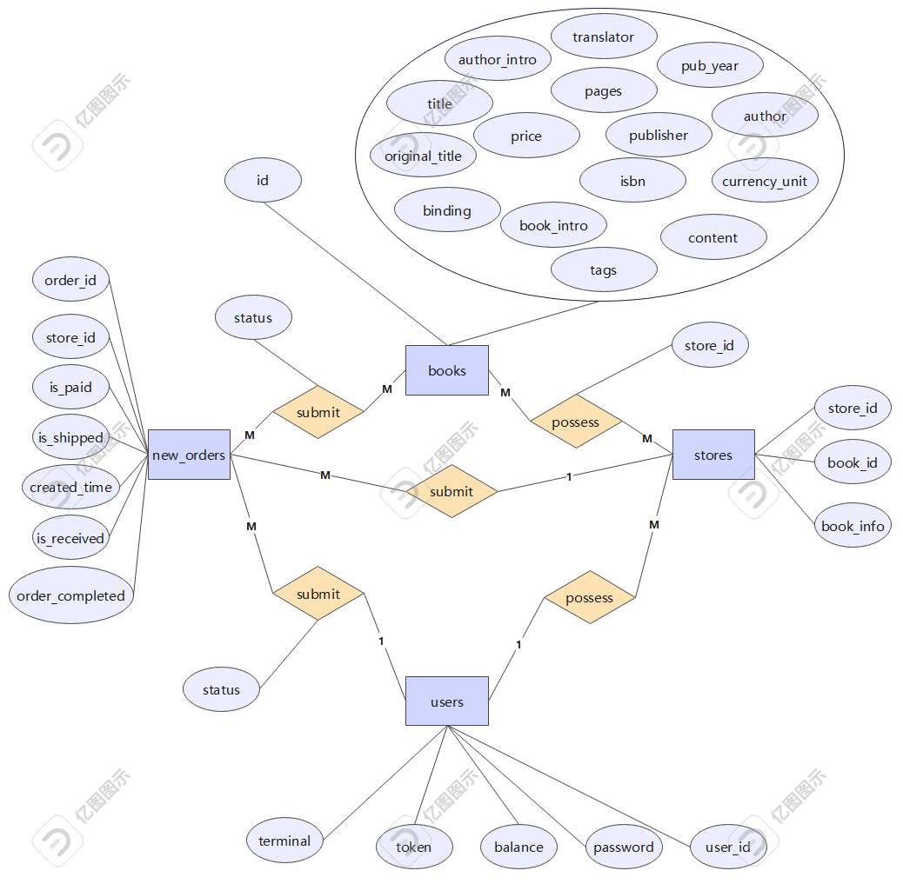

# DBLab2_bookstore 实验报告
## 实验要求
本次实验的整体要求和Lab1相同，

## 简述从文档型数据库到关系型数据库的改动，以及改动的理由
### 改动之处
首先查看原本文档型数据库中books表的Schema：
```Python
Collection: books
  _id: ObjectId
  id: str
  title: str
  author: NoneType, str
  publisher: str
  original_title: NoneType, str
  translator: NoneType, str
  pub_year: str
  pages: int
  price: int
  currency_unit: str
  binding: str
  isbn: str
  author_intro: str
  book_intro: str
  content: str
  tags: str
  picture: bytes
```
根据实验手册的要求：核心数据使用关系型数据库（PostgreSQL 或 MySQL 数据库），blob 数据（如图片和大段的文字描述）可以分离出来存其它 NoSQL 数据库或文件系统。那么在查看了最原始的数据库中的数据类型，发现blob数据主要就是图片，那么我们将图片分离出来，存储在MongoDB数据库中，其余的数据都存储在PostgreSQL数据库中。为了方便两者的关联查找，通过`id`字段作为两个数据库的关联字段，方便进行联合查询等功能。  

对于还要新增的五个表，全部都存入到了关系型数据库中，其中不含有blob数据。

### 改动理由
1. 更方便维护关系：关系型数据库通常会通过外键约束、唯一性约束等机制确保数据的完整性和一致性，对于bookstore来说，字中包含了大量相关联的数据，例如书的标题、作者、出版社等，关系型数据库可以更好地维护这些关系。  
2. 查询性能更好：文档型数据库通常更适合处理半结构化和非结构化的数据，而在这里，大多数都是结构化的数据，对于结构化数据和复杂的多表关联查询，关系型数据库通常会提供更好的性能。在本次实验中，会用到很多关联查询的情况，关系型数据库会更加高效。  
3. 事务处理的支持：在MongoDB 4.0版本之前，是不支持事务处理的。而事务处理一直都是关系型数据库提供的功能，保证了数据到原子性、一致性、隔离性和持久性。这对于本次实验中会用到的库存更新、资金更新等操作来说是很重要的。

## 关系数据库设计：关系型 schema
1. books表：
```Python
    id text NOT NULL,
    title text,
    author text,
    publisher text,
    original_title text,
    translator text,
    pub_year text,
    pages integer,
    price real,
    currency_unit text,
    binding text,
    isbn text,
    author_intro text,
    book_intro text,
    content text,
    tags text
```
其中，主键为`id`。

2. new_orders_detail表：
```Python
    order_id text NOT NULL,
    book_id text NOT NULL,
    count integer,
    price integer
```
其中，主键为`order_id`和`book_id`。

3. new_orders表：
```Python
    order_id text NOT NULL,
    user_id text,
    store_id text,
    is_paid boolean,
    is_shipped boolean,
    is_received boolean,
    order_completed boolean,
    status text,
    created_time text
```
其中，主键为`order_id`。

4. stores表：
```Python
    store_id text NOT NULL,
    book_id text NOT NULL,
    book_info text,
    stock_level integer
```
其中，主键为`store_id`和`book_id`。

5. user_store表：
```Python
    user_id text NOT NULL,
    store_id text NOT NULL
```
其中，主键为`user_id`和`store_id`。

6. users表：
```Python
    user_id text NOT NULL,
    password text NOT NULL,
    balance integer NOT NULL,
    token text,
    terminal text
```
其中，主键为`user_id`。  

## ER图

其中，不同表的关系如下：  
1. `new_orders`表和`users`、`stores`表都是**一对多**的关系，因为一个用户可以有很多订单，但是一个订单只能指向一个用户；一个商店可以有很多订单，但是一个订单只能属于一个商店。因此新建了`new_orders_detail`表，用于存储它们三者之间的关系，通过`user_id`和`store_id`作为外键关联。  
2. `users`表和`stores`表是**一对多**的关系，因为一个用户可以拥有多个商店，但是一个商店只能属于一个用户。因此新建了`user_store`表，用于存储它们两者之间的关系，通过`user_id`和`store_id`作为外键关联。  
3. `stores`表和`books`表是**多对多**的关系，因为一个商店可以拥有多本图书，一本图书也可以属于多个商店。因此更新了`stores`表，用于存储它们两者之间的关系。
4. `new_orders`表和`books`表是**多对多**的关系，因为一个订单可以购买多本图书，一本图书也可以被多个订单购买。因此新建了`new_orders_detail`表，用于存储它们两者之间的关系，通过`order_id`和`book_id`作为外键关联。

## 功能介绍

## 事务处理

## 测试结果

## 版本管理