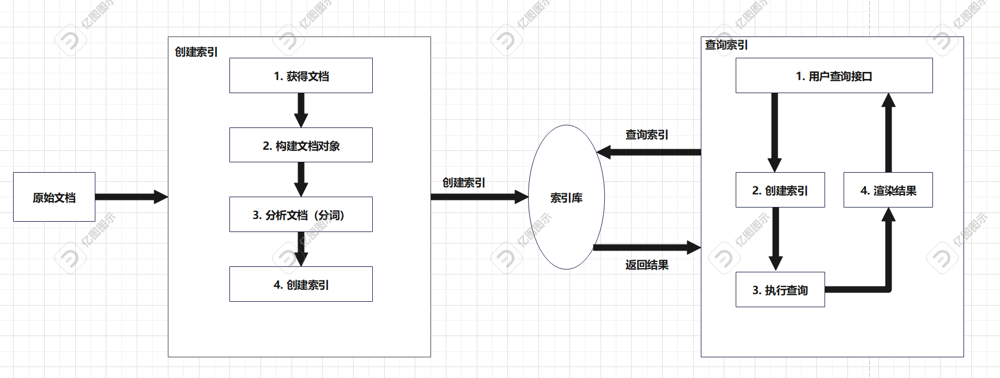
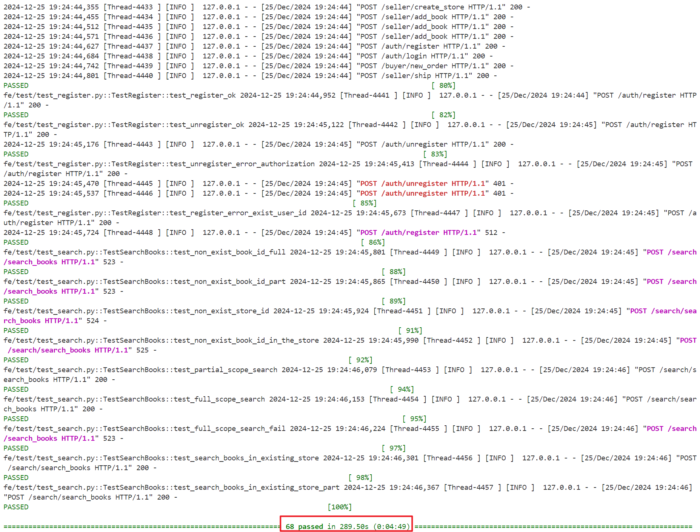
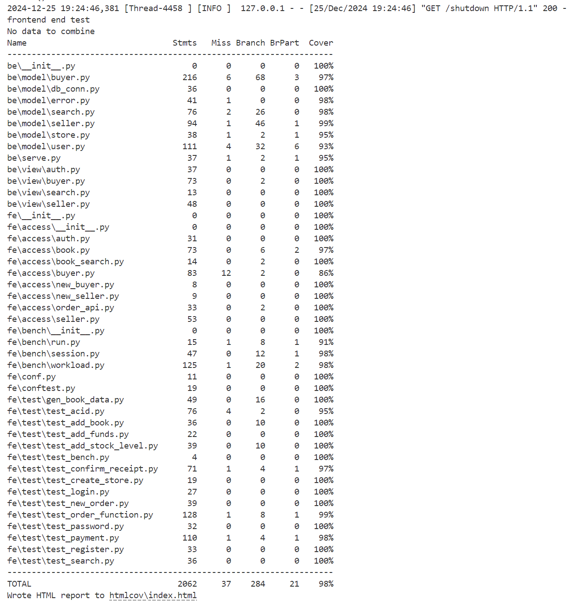

# DBLab2_bookstore 实验报告
## 实验要求
本次实验的整体要求和Lab1相同，

## 简述从文档型数据库到关系型数据库的改动，以及改动的理由
### 改动之处
首先查看原本文档型数据库中books表的Schema：
```Python
Collection: books
  _id: ObjectId
  id: str
  title: str
  author: NoneType, str
  publisher: str
  original_title: NoneType, str
  translator: NoneType, str
  pub_year: str
  pages: int
  price: int
  currency_unit: str
  binding: str
  isbn: str
  author_intro: str
  book_intro: str
  content: str
  tags: str
  picture: bytes
```
根据实验手册的要求：核心数据使用关系型数据库（PostgreSQL 或 MySQL 数据库），blob 数据（如图片和大段的文字描述）可以分离出来存其它 NoSQL 数据库或文件系统。那么在查看了最原始的数据库中的数据类型，发现blob数据主要就是图片，那么我们将图片分离出来，存储在MongoDB数据库中，其余的数据都存储在PostgreSQL数据库中。为了方便两者的关联查找，通过`id`字段作为两个数据库的关联字段，方便进行联合查询等功能。  

对于还要新增的五个表，全部都存入到了关系型数据库中，其中不含有blob数据。

### 改动理由
1. 更方便维护关系：关系型数据库通常会通过外键约束、唯一性约束等机制确保数据的完整性和一致性，对于bookstore来说，字中包含了大量相关联的数据，例如书的标题、作者、出版社等，关系型数据库可以更好地维护这些关系。  
2. 查询性能更好：文档型数据库通常更适合处理半结构化和非结构化的数据，而在这里，大多数都是结构化的数据，对于结构化数据和复杂的多表关联查询，关系型数据库通常会提供更好的性能。在本次实验中，会用到很多关联查询的情况，关系型数据库会更加高效。  
3. 事务处理的支持：在MongoDB 4.0版本之前，是不支持事务处理的。而事务处理一直都是关系型数据库提供的功能，保证了数据到原子性、一致性、隔离性和持久性。这对于本次实验中会用到的库存更新、资金更新等操作来说是很重要的。

## 关系数据库设计：关系型 schema
1. books表：
```Python
    id text NOT NULL,
    title text,
    author text,
    publisher text,
    original_title text,
    translator text,
    pub_year text,
    pages integer,
    price real,
    currency_unit text,
    binding text,
    isbn text,
    author_intro text,
    book_intro text,
    content text,
    tags text
```
其中，主键为`id`。

2. new_orders_detail表：
```Python
    order_id text NOT NULL,
    book_id text NOT NULL,
    count integer,
    price integer
```
其中，主键为`order_id`和`book_id`。

3. new_orders表：
```Python
    order_id text NOT NULL,
    user_id text,
    store_id text,
    is_paid boolean,
    is_shipped boolean,
    is_received boolean,
    order_completed boolean,
    status text,
    created_time text
```
其中，主键为`order_id`。

4. stores表：
```Python
    store_id text NOT NULL,
    book_id text NOT NULL,
    book_info text,
    stock_level integer
```
其中，主键为`store_id`和`book_id`。

5. user_store表：
```Python
    user_id text NOT NULL,
    store_id text NOT NULL
```
其中，主键为`user_id`和`store_id`。

6. users表：
```Python
    user_id text NOT NULL,
    password text NOT NULL,
    balance integer NOT NULL,
    token text,
    terminal text
```
其中，主键为`user_id`。  

## ER图

其中，不同表的关系如下：  
1. `new_orders`表和`users`、`stores`表都是**一对多**的关系，因为一个用户可以有很多订单，但是
            CREATE INDEX IF NOT EXISTS idx_books_tit一个订单只能指向一个用户；一个商店可以有很多订单，但是一个订单只能属于一个商店。因此新建了`new_orders_detail`表，用于存储它们三者之间的关系，通过`user_id`和`store_id`作为外键关联。  
2. `users`表和`stores`表是**一对多**的关系，因为一个用户可以拥有多个商店，但是一个商店只能属于一个用户。因此新建了`user_store`表，用于存储它们两者之间的关系，通过`user_id`和`store_id`作为外键关联。  
3. `stores`表和`books`表是**多对多**的关系，因为一个商店可以拥有多本图书，一本图书也可以属于多个商店。因此更新了`stores`表，用于存储它们两者之间的关系。
4. `new_orders`表和`books`表是**多对多**的关系，因为一个订单可以购买多本图书，一本图书也可以被多个订单购买。因此新建了`new_orders_detail`表，用于存储它们两者之间的关系，通过`order_id`和`book_id`作为外键关联。

## 功能介绍
本次实现的功能与Lab1功能几乎一致，新增了几个函数用于后续的测试。下面是对各功能的介绍： 

### 注册用户

#### URL：
POST http://$address$/auth/register

#### Request

Body:
```
{
    "user_id":"$user name$",
    "password":"$user password$"
}
```

变量名 | 类型 | 描述 | 是否可为空
---|---|---|---
user_id | string | 用户名 | N
password | string | 登陆密码 | N

#### Response

Status Code:


码 | 描述
--- | ---
200 | 注册成功
512 | 注册失败，用户名重复

Body:
```
{
    "message":"$error message$"
}
```
变量名 | 类型 | 描述 | 是否可为空
---|---|---|---
message | string | 返回错误消息，成功时为"ok" | N

#### 对应测试代码
```Python
    def test_register_ok(self):
        code = self.auth.register(self.user_id, self.password)
        assert code == 200
    
    def test_register_error_exist_user_id(self):
        code = self.auth.register(self.user_id, self.password)
        assert code == 200

        code = self.auth.register(self.user_id, self.password)
        assert code != 200
```

#### 对应后端实现代码
```Python
    def register(self, user_id: str, password: str):
        try:
            # 检查是否已经存在相同的 user_id
            self.cursor.execute(sql.SQL("SELECT * FROM users WHERE user_id = %s"), (user_id,))
            existing_user = self.cursor.fetchone()
            if existing_user:
                return error.error_exist_user_id(user_id)

            terminal = f"terminal_{time.time()}"
            token = jwt_encode(user_id, terminal)
            self.cursor.execute(
                sql.SQL("INSERT INTO users (user_id, password, balance, token, terminal) VALUES (%s, %s, %s, %s, %s)"),
                (user_id, password, 0, token, terminal)
            )
            self.conn.commit()
        except Exception as e:  # pragma: no cover
            logging.error(f"Error during registration: {str(e)}")
            self.conn.rollback()
            return error.error_exist_user_id(user_id)
        return 200, "ok"
```

上述代码实现了一个注册用户的功能，说明如下：

1. **检查用户是否存在**：
  - 使用 SQL 查询检查数据库中是否已存在相同的 `user_id`。
  - 如果存在，返回错误信息 `error.error_exist_user_id(user_id)`。

2.  **生成终端标识和令牌**：
  - 如果用户不存在，生成一个唯一的终端标识 `terminal`，格式为 `terminal_` 加上当前时间戳。
  - 使用 JWT 编码生成一个令牌 `token`，包含 `user_id` 和 `terminal`。

3.  **插入新用户数据**：
  - 将新用户的 `user_id`、`password`、初始余额 `0`、生成的 `token` 和 `terminal` 插入到 `users` 表中。
  - 提交事务以确保数据持久化。

4.  **异常处理**：
  - 如果在注册过程中发生任何异常，记录错误日志并回滚事务，确保数据库状态一致。
  - 返回错误信息 `error.error_exist_user_id(user_id)`。

5.  **返回结果**：
  - 如果注册成功，返回状态码 `200` 和消息 `"ok"`。

### 注销用户

#### URL：
POST http://$address$/auth/unregister

#### Request

Body:
```
{
    "user_id":"$user name$",
    "password":"$user password$"
}
```

变量名 | 类型 | 描述 | 是否可为空
---|---|---|---
user_id | string | 用户名 | N
password | string | 登陆密码 | N

#### Response

Status Code:


码 | 描述
--- | ---
200 | 注销成功
401 | 注销失败，用户名不存在或密码不正确


Body:
```
{
    "message":"$error message$"
}
```
变量名 | 类型 | 描述 | 是否可为空
---|---|---|---
message | string | 返回错误消息，成功时为"ok" | N

#### 对应测试代码
```Python
    def test_unregister_ok(self):
        code = self.auth.register(self.user_id, self.password)
        assert code == 200

        code = self.auth.unregister(self.user_id, self.password)
        assert code == 200

    def test_unregister_error_authorization(self):
        code = self.auth.register(self.user_id, self.password)
        assert code == 200

        code = self.auth.unregister(self.user_id + "_x", self.password)
        assert code != 200

        code = self.auth.unregister(self.user_id, self.password + "_x")
        assert code != 200
```

#### 对应后端实现代码
```Python
    def unregister(self, user_id: str, password: str) -> (int, str):
        try:
            code, message = self.check_password(user_id, password)
            if code != 200:
                return code, message

            self.cursor.execute(sql.SQL("DELETE FROM users WHERE user_id = %s"), (user_id,))
            self.conn.commit()
            if self.cursor.rowcount == 0:
                return error.error_authorization_fail()
        except Exception as e:  # pragma: no cover
            logging.error(f"Error during unregister: {str(e)}")
            self.conn.rollback()
            return 528, "{}".format(str(e))
        return 200, "ok"
```

上述代码实现了一个注销用户的功能，说明如下：

1. **参数校验**：
  - 接收 `user_id` 和 `password` 参数。
  - 调用 `check_password` 方法验证用户密码是否正确。如果验证失败，则直接返回错误码和消息。

2. **执行删除操作**：
  - 如果密码验证成功，执行 SQL 删除语句，从 `users` 表中删除指定 `user_id` 的用户记录。
  - 提交事务 (`self.conn.commit()`)。

3. **检查删除结果**：
  - 检查受影响的行数 (`self.cursor.rowcount`)。如果没有匹配的用户记录被删除，则调用 `error.error_authorization_fail()` 返回授权失败的错误信息。

4. **异常处理**：
  - 如果在执行过程中发生异常，捕获异常并记录错误日志 (`logging.error`)。
  - 回滚事务 (`self.conn.rollback()`) 并返回错误码 528 和异常信息。

5. **返回结果**：
  - 如果删除成功，返回状态码 200 和消息 "ok"。


### 用户登录

#### URL：
POST http://$address$/auth/login

#### Request

Body:
```
{
    "user_id":"$user name$",
    "password":"$user password$",
    "terminal":"$terminal code$"
}
```

变量名 | 类型 | 描述 | 是否可为空
---|---|---|---
user_id | string | 用户名 | N
password | string | 登陆密码 | N
terminal | string | 终端代码 | N

#### Response

Status Code:

码 | 描述
--- | ---
200 | 登录成功
401 | 登录失败，用户名或密码错误

Body:
```
{
    "message":"$error message$",
    "token":"$access token$"
}
```
变量名 | 类型 | 描述 | 是否可为空
---|---|---|---
message | string | 返回错误消息，成功时为"ok" | N
token | string | 访问token，用户登录后每个需要授权的请求应在headers中传入这个token | 成功时不为空

#### 说明 

1.terminal标识是哪个设备登录的，不同的设备拥有不同的ID，测试时可以随机生成。 

2.token是登录后，在客户端中缓存的令牌，在用户登录时由服务端生成，用户在接下来的访问请求时不需要密码。token会定期地失效，对于不同的设备，token是不同的。token只对特定的时期特定的设备是有效的。

#### 对应测试代码
```Python
    def test_ok(self):
        code, token = self.auth.login(self.user_id, self.password, self.terminal)
        assert code == 200

    def test_error_user_id(self):
        code, token = self.auth.login(self.user_id + "_x", self.password, self.terminal)
        assert code == 401

    def test_error_password(self):
        code, token = self.auth.login(self.user_id, self.password + "_x", self.terminal)
        assert code == 401
```

#### 对应后端实现代码
```Python
    def login(self, user_id: str, password: str, terminal: str) -> (int, str, str):
        token = ""
        try:
            code, message = self.check_password(user_id, password)
            if code != 200:
                return code, message, ""

            token = jwt_encode(user_id, terminal)
            self.cursor.execute(
                sql.SQL("UPDATE users SET token = %s, terminal = %s WHERE user_id = %s"),
                (token, terminal, user_id)
            )
            self.conn.commit()
            if self.cursor.rowcount == 0:
                return error.error_authorization_fail() + ("",)
        except Exception as e:  # pragma: no cover
            logging.error(f"Error during login: {str(e)}")
            self.conn.rollback()
            return 528, "{}".format(str(e)), ""
        return 200, "ok", token
```

上述代码实现了一个用户登录的功能，说明如下：  

1. **参数校验**：
  - 接收 `user_id`、`password` 和 `terminal` 参数。
  
2.  **密码验证**：
  - 调用 `self.check_password(user_id, password)` 方法检查用户密码是否正确。
  - 如果密码验证失败（返回码不是 200），则直接返回错误信息和空字符串作为 token。

3. **生成 Token**：
  - 如果密码验证成功，使用 `jwt_encode(user_id, terminal)` 生成一个 JWT token。

4. **更新数据库**：
  - 使用生成的 token 和终端信息更新数据库中的用户记录。
  - 执行 SQL 更新语句：`UPDATE users SET token = %s, terminal = %s WHERE user_id = %s`。
  - 提交事务 (`self.conn.commit()`)。
  - 检查是否有行被更新，如果没有行被更新，则返回授权失败的错误信息。

5. **异常处理**：
  - 如果在上述过程中发生任何异常，捕获异常并记录错误日志。
  - 回滚数据库事务 (`self.conn.rollback()`)。
  - 返回错误代码 528 和异常信息。

6. **返回结果**：
  - 如果所有操作成功，返回状态码 200、消息 "ok" 和生成的 token。


### 用户更改密码

#### URL：
POST http://$address$/auth/password

#### Request

Body:
```
{
    "user_id":"$user name$",
    "oldPassword":"$old password$",
    "newPassword":"$new password$"
}
```

变量名 | 类型 | 描述 | 是否可为空
---|---|---|---
user_id | string | 用户名 | N
oldPassword | string | 旧的登陆密码 | N
newPassword | string | 新的登陆密码 | N

#### Response

Status Code:

码 | 描述
--- | ---
200 | 更改密码成功
401 | 更改密码失败

Body:
```
{
    "message":"$error message$",
}
```
变量名 | 类型 | 描述 | 是否可为空
---|---|---|---
message | string | 返回错误消息，成功时为"ok" | N

#### 对应测试代码
```Python
    def test_ok(self):
        code = self.auth.password(self.user_id, self.old_password, self.new_password)
        assert code == 200

        code, new_token = self.auth.login(
            self.user_id, self.old_password, self.terminal
        )
        assert code != 200

        code, new_token = self.auth.login(
            self.user_id, self.new_password, self.terminal
        )
        assert code == 200

        code = self.auth.logout(self.user_id, new_token)
        assert code == 200

    def test_error_password(self):
        code = self.auth.password(
            self.user_id, self.old_password + "_x", self.new_password
        )
        assert code != 200

        code, new_token = self.auth.login(
            self.user_id, self.new_password, self.terminal
        )
        assert code != 200

    def test_error_user_id(self):
        code = self.auth.password(
            self.user_id + "_x", self.old_password, self.new_password
        )
        assert code != 200

        code, new_token = self.auth.login(
            self.user_id, self.new_password, self.terminal
        )
        assert code != 200
```

#### 对应后端实现代码
```Python
    def change_password(
        self, user_id: str, old_password: str, new_password: str
    ) -> bool:
        try:
            code, message = self.check_password(user_id, old_password)
            if code != 200:
                return code, message

            terminal = f"terminal_{time.time()}"
            token = jwt_encode(user_id, terminal)
            self.cursor.execute(
                sql.SQL("UPDATE users SET password = %s, token = %s, terminal = %s WHERE user_id = %s"),
                (new_password, token, terminal, user_id)
            )
            self.conn.commit()
            if self.cursor.rowcount == 0:
                return error.error_authorization_fail()
        except Exception as e:  # pragma: no cover
            logging.error(f"Error during change_password: {str(e)}")
            self.conn.rollback()
            return 528, "{}".format(str(e))
        return 200, "ok"
```

上述代码实现了一个用户更改密码的功能，说明如下：

1. **验证旧密码**：
  - 调用 `self.check_password(user_id, old_password)` 检查用户提供的旧密码是否正确。
  - 如果返回的状态码不是 200（表示成功），则直接返回错误信息。

2. **生成新 token 和 terminal**：
  - 使用当前时间戳生成一个唯一的 `terminal` 标识符。
  - 使用 `jwt_encode` 函数为用户生成一个新的 JWT `token`。

3. **更新数据库**：
  - 执行 SQL 更新语句，将用户的密码、`token` 和 `terminal` 更新到数据库中。
  - 提交事务 (`self.conn.commit()`)。

4. **检查更新结果**：
  - 如果没有行被更新（即 `self.cursor.rowcount == 0`），则返回授权失败的错误信息。

5. **异常处理**：
  - 如果在执行过程中发生任何异常，记录错误日志并回滚事务 (`self.conn.rollback()`)，然后返回错误信息。

6. **返回结果**：
  - 如果一切顺利，返回状态码 200 和 "ok" 表示操作成功。

### 用户登出

#### URL：
POST http://$address$/auth/logout

#### Request

Headers:

key | 类型 | 描述
---|---|---
token | string | 访问token

Body:
```
{
    "user_id":"$user name$"
}
```

变量名 | 类型 | 描述 | 是否可为空
---|---|---|---
user_id | string | 用户名 | N

#### Response

Status Code:

码 | 描述
--- | ---
200 | 登出成功
401 | 登出失败，用户名或token错误

Body:
```
{
    "message":"$error message$"
}
```
变量名 | 类型 | 描述 | 是否可为空
---|---|---|---
message | string | 返回错误消息，成功时为"ok" | N

#### 对应测试代码
```Python
    def test_ok(self):
        code = self.auth.logout(self.user_id + "_x", token)
        assert code == 401

        code = self.auth.logout(self.user_id, token + "_x")
        assert code == 401

        code = self.auth.logout(self.user_id, token)
        assert code == 200
```

#### 对应后端实现代码
```Python
    def logout(self, user_id: str, token: str) -> bool:
        try:
            code, message = self.check_token(user_id, token)
            if code != 200:
                return code, message

            terminal = f"terminal_{time.time()}"
            dummy_token = jwt_encode(user_id, terminal)

            self.cursor.execute(
                sql.SQL("UPDATE users SET token = %s, terminal = %s WHERE user_id = %s"),
                (dummy_token, terminal, user_id)
            )
            self.conn.commit()
            if self.cursor.rowcount == 0:
                return error.error_authorization_fail()
        except Exception as e:  # pragma: no cover
            logging.error(f"Error during logout: {str(e)}")
            self.conn.rollback()
            return 528, "{}".format(str(e))
        return 200, "ok"
```

上述代码实现了一个用户登出的功能，说明如下：  

1. **验证 Token**：
  - 调用 `self.check_token(user_id, token)` 方法检查传入的 `user_id` 和 `token` 是否有效。
  - 如果验证失败（返回的状态码不是 200），直接返回错误信息。

2. **生成新的临时 Token 和终端标识**：
  - 使用当前时间戳生成一个新的终端标识 `terminal`。
  - 使用 `jwt_encode` 函数为用户生成一个无效的 `dummy_token`，用于替换数据库中的有效 Token。

3. **更新数据库**：
  - 执行 SQL 更新语句，将用户的 `token` 和 `terminal` 字段更新为新生成的无效值。
  - 提交事务 (`self.conn.commit()`)。
  - 检查是否有行受到影响（即是否找到并更新了对应的用户记录）。如果没有影响任何行，则返回授权失败的错误。

4. **异常处理**：
  - 如果在执行过程中发生异常，捕获异常并记录错误日志。
  - 回滚事务 (`self.conn.rollback()`) 并返回错误信息。

5. **返回结果**：
  - 如果所有操作都成功完成，返回状态码 200 和消息 "ok"。

### 买家下单

#### URL：
POST http://[address]/buyer/new_order

#### Request

##### Header:

key | 类型 | 描述 | 是否可为空
---|---|---|---
token | string | 登录产生的会话标识 | N

##### Body:
```json
{
  "user_id": "buyer_id",
  "store_id": "store_id",
  "books": [
    {
      "id": "1000067",
      "count": 1
    },
    {
      "id": "1000134",
      "count": 4
    }
  ]
}
```

##### 属性说明：

变量名 | 类型 | 描述 | 是否可为空
---|---|---|---
user_id | string | 买家用户ID | N
store_id | string | 商铺ID | N
books | class | 书籍购买列表 | N

books数组：

变量名 | 类型 | 描述 | 是否可为空
---|---|---|---
id | string | 书籍的ID | N
count | string | 购买数量 | N


#### Response

Status Code:

码 | 描述
--- | ---
200 | 下单成功
5XX | 买家用户ID不存在
513 | 商铺ID不存在
515 | 购买的图书不存在
519 | 商品库存不足

##### Body:
```json
{
  "order_id": "uuid"
}
```

##### 属性说明：

变量名 | 类型 | 描述 | 是否可为空
---|---|---|---
order_id | string | 订单号，只有返回200时才有效 | N

#### 对应测试代码
```Python
    def test_non_exist_book_id(self):
        ok, buy_book_id_list = self.gen_book.gen(
            non_exist_book_id=True, low_stock_level=False
        )
        assert ok
        code, _ = self.buyer.new_order(self.store_id, buy_book_id_list)
        assert code != 200

    def test_low_stock_level(self):
        ok, buy_book_id_list = self.gen_book.gen(
            non_exist_book_id=False, low_stock_level=True
        )
        assert ok
        code, _ = self.buyer.new_order(self.store_id, buy_book_id_list)
        assert code != 200

    def test_ok(self):
        ok, buy_book_id_list = self.gen_book.gen(
            non_exist_book_id=False, low_stock_level=False
        )
        assert ok
        code, _ = self.buyer.new_order(self.store_id, buy_book_id_list)
        assert code == 200

    def test_non_exist_user_id(self):
        ok, buy_book_id_list = self.gen_book.gen(
            non_exist_book_id=False, low_stock_level=False
        )
        assert ok
        self.buyer.user_id = self.buyer.user_id + "_x"
        code, _ = self.buyer.new_order(self.store_id, buy_book_id_list)
        assert code != 200

    def test_non_exist_store_id(self):
        ok, buy_book_id_list = self.gen_book.gen(
            non_exist_book_id=False, low_stock_level=False
        )
        assert ok
        code, _ = self.buyer.new_order(self.store_id + "_x", buy_book_id_list)
        assert code != 200
```

#### 对应后端实现代码
```Python
    def new_order(self, user_id: str, store_id: str, id_and_count: [(str, int)]) -> (int, str, str):
        order_id = ""
        try:
            if not self.user_id_exist(user_id):
                return error.error_non_exist_user_id(user_id) + (order_id,)
            if not self.store_id_exist(store_id):
                return error.error_non_exist_store_id(store_id) + (order_id,)
            
            # 生成订单ID
            uid = f"{user_id}_{store_id}_{uuid.uuid1()}"

            # 遍历每本书籍及其数量
            for book_id, count in id_and_count:
                # 查找书籍库存
                with self.conn.cursor() as cursor:
                    cursor.execute("""
                        SELECT stock_level, book_info 
                        FROM stores 
                        WHERE store_id = %s AND book_id = %s
                    """, (store_id, book_id))
                    store_item = cursor.fetchone()

                if store_item is None:
                    return error.error_non_exist_book_id(book_id) + (order_id,)
                
                stock_level, book_info_str = store_item
                book_info = json.loads(book_info_str)
                price = book_info.get("price")

                if stock_level < count:
                    return error.error_stock_level_low(book_id) + (order_id,)
                
                # 更新库存
                with self.conn.cursor() as cursor:
                    cursor.execute("""
                        UPDATE stores 
                        SET stock_level = stock_level - %s 
                        WHERE store_id = %s AND book_id = %s AND stock_level >= %s
                    """, (count, store_id, book_id, count))
                    if cursor.rowcount == 0:
                        return error.error_stock_level_low(book_id) + (order_id,)
                
                # 插入订单详情
                with self.conn.cursor() as cursor:
                    cursor.execute("""
                        INSERT INTO new_order_details (order_id, book_id, count, price) 
                        VALUES (%s, %s, %s, %s)
                    """, (uid, book_id, count, price))
            
            # 插入订单，新增 is_shipped 和 is_received 初始为 False
            with self.conn.cursor() as cursor:
                cursor.execute("""
                    INSERT INTO new_orders (order_id, store_id, user_id, is_paid, is_shipped, is_received, order_completed, status, created_time) 
                    VALUES (%s, %s, %s, %s, %s, %s, %s, %s, %s)
                """, (uid, store_id, user_id, False, False, False, False, "pending", datetime.utcnow()))
            
            self.conn.commit()
            order_id = uid
        except Exception as e:
            logging.error(f"Error creating new order: {e}")
            self.conn.rollback()
            return 530, "{}".format(str(e)), ""

        return 200, "ok", order_id
```

上述代码实现了一个买家下单的功能，说明如下：  

1. **参数校验**：
  - 检查用户ID是否存在，如果不存在返回错误。
  - 检查商店ID是否存在，如果不存在返回错误。

2.  **生成订单ID**：
  - 使用用户ID、商店ID和UUID生成唯一的订单ID。

3. **遍历书籍列表**：
  - 对于每本书籍及其数量：
    - 查询书籍在指定商店中的库存信息。
    - 如果书籍不存在，返回错误。
    - 获取书籍的价格。
    - 检查库存是否足够，如果不足返回错误。
    - 更新库存，减少相应数量。
    - 插入订单详情到数据库。

4. **插入订单信息**：
  - 将订单信息插入到订单表中，设置初始状态（如未支付、未发货、未收货等）。
  
5. **提交事务**：
  - 提交所有数据库操作。
  - 设置 `order_id` 为生成的唯一ID。

6. **异常处理**：
  - 如果过程中出现任何异常，记录错误日志并回滚事务，返回错误信息。

7. **返回结果**：
  - 返回状态码、消息和订单ID。


### 买家付款

#### URL：
POST http://[address]/buyer/pay_to_platform

#### Request

##### Body:
```json
{
  "user_id": "buyer_id",
  "order_id": "order_id",
  "password": "password"
}
```

##### 属性说明：

变量名 | 类型 | 描述 | 是否可为空
---|---|---|---
user_id | string | 买家用户ID | N
order_id | string | 订单ID | N
password | string | 买家用户密码 | N 


#### Response

Status Code:

码 | 描述
--- | ---
200 | 付款成功
400 | 已付款
401 | 授权失败 
511 | 账户不存在
518 | 订单不存在
519 | 账户余额不足
526 | 订单已被取消
527 | 订单重复支付
530 | 无效参数

#### 对应测试代码
```Python
    def test_ok(self):
        code = self.buyer.add_funds(self.total_price)
        assert code == 200
        code = self.buyer.payment(self.order_id)
        assert code == 200

    def test_authorization_error(self):
        code = self.buyer.add_funds(self.total_price)
        assert code == 200
        self.buyer.password = self.buyer.password + "_x"
        code = self.buyer.payment(self.order_id)
        assert code == 401

    def test_not_suff_funds(self):
        code = self.buyer.add_funds(self.total_price - 1)
        assert code == 200
        code = self.buyer.payment(self.order_id)
        assert code == 519

    def test_repeat_pay(self):
        code = self.buyer.add_funds(self.total_price)
        assert code == 200
        code = self.buyer.payment(self.order_id)
        assert code == 200

        code = self.buyer.payment(self.order_id)
        assert code == 527

    def test_order_is_exist(self):
        code = self.buyer.add_funds(self.total_price)
        assert code == 200
        
        self.order_id = self.order_id + "_x"

        code = self.buyer.payment(self.order_id)
        assert code == 518

    def test_pay_order_id_is_equal(self):
        code = self.buyer.add_funds(self.total_price)
        assert code == 200
        
        self.buyer.user_id = self.buyer.user_id + "_x"
        
        code = self.buyer.payment(self.order_id)
        assert code == 401

    def test_ship_order(self):
        code= self.buyer.add_funds(self.total_price)
        assert code == 200
        code = self.buyer.payment(self.order_id)

        code = self.seller.ship(self.seller_id, self.store_id, self.order_id)
        assert code == 200

    def test_ship_order_non_existent_user(self):
        code= self.buyer.add_funds(self.total_price)
        assert code == 200
        code = self.buyer.payment(self.order_id)
        code = self.seller.ship("non_existent_user", self.store_id, self.order_id)
        assert code == 511

    def test_ship_order_non_existent_store(self):
        code= self.buyer.add_funds(self.total_price)
        assert code == 200
        code = self.buyer.payment(self.order_id)
        code = self.seller.ship(self.seller_id, "non_existent_store", self.order_id)
        assert code == 513

    def test_ship_order_non_existent_order(self):
        code= self.buyer.add_funds(self.total_price)
        assert code == 200
        code = self.buyer.payment(self.order_id)
        code = self.seller.ship(self.seller_id, self.store_id, "non_existent_order")
        assert code == 518

    def test_repeat_ship_order(self):
        code= self.buyer.add_funds(self.total_price)
        assert code == 200
        code = self.buyer.payment(self.order_id)
        
        code = self.seller.ship(self.seller_id, self.store_id, self.order_id)
        assert code == 200

        code = self.seller.ship(self.seller_id, self.store_id, self.order_id)
        assert code == 529
```

#### 对应后端实现代码
```Python
    def pay_to_platform(self, user_id: str, password: str, order_id: str) -> (int, str):
        try:
            # 查找订单
            with self.conn.cursor() as cursor:
                cursor.execute("SELECT * FROM new_orders WHERE order_id = %s", (order_id,))
                order = cursor.fetchone()

            if order is None:
                return error.error_invalid_order_id(order_id)

            buyer_id = order[1]

            # 检查用户身份
            if buyer_id != user_id:
                return error.error_authorization_fail()

            with self.conn.cursor() as cursor:
                cursor.execute("SELECT * FROM users WHERE user_id = %s", (buyer_id,))
                user = cursor.fetchone()

            if user is None or user[1] != password:
                return error.error_authorization_fail()
                

            # 检查是否已经付款
            if order[3]:
                return error.error_order_is_paid(order_id)

            # 计算订单总价
            with self.conn.cursor() as cursor:
                cursor.execute("SELECT count, price FROM new_order_details WHERE order_id = %s", (order_id,))
                order_details = cursor.fetchall()

            total_price = sum(count * price for count, price in order_details)

            if user[2] < total_price:
                return error.error_not_sufficient_funds(order_id)

            # 扣除买家的余额，平台收款
            with self.conn.cursor() as cursor:
                cursor.execute("""
                    UPDATE users 
                    SET balance = balance - %s 
                    WHERE user_id = %s AND balance >= %s
                """, (total_price, buyer_id, total_price))
                if cursor.rowcount == 0:
                    return error.error_not_sufficient_funds(order_id)

            # 更新订单状态为已付款
            with self.conn.cursor() as cursor:
                cursor.execute("""
                    UPDATE new_orders 
                    SET is_paid = %s 
                    WHERE order_id = %s
                """, (True, order_id))

            self.conn.commit()

        except Exception as e:
            logging.error(f"Error paying to platform: {e}")
            self.conn.rollback()
            return 530, "{}".format(str(e))

        return 200, "ok"
```

上述代码实现了一个买家付款的功能，说明如下：

1. **查找订单**：根据提供的 `order_id` 查找对应的订单信息。
    - 如果找不到订单，返回无效订单ID错误。

2. **检查用户身份**：
    - 确认订单中的买家ID与传入的 `user_id` 是否一致。
    - 验证用户的密码是否正确。
    - 如果任意一项不匹配，返回授权失败错误。

3. **检查订单状态**：
    - 如果订单已经被支付过，返回订单已支付错误。

4. **计算订单总价**：
    - 查询订单详情表以获取每个商品的数量和单价，计算总金额。

5. **检查余额**：
    - 检查用户的余额是否足够支付订单总价。
    - 如果余额不足，返回资金不足错误。

6. **更新用户余额和订单状态**：
    - 扣除用户账户中的余额。
    - 更新订单状态为已付款。
    - 提交事务到数据库。

7. **异常处理**：
    - 如果在执行过程中发生任何异常，记录日志并回滚事务，返回相应的错误信息。

8. **返回结果**：
    - 函数返回成功状态码和确认消息。

### 买家充值

#### URL：
POST http://[address]/buyer/add_funds

#### Request


##### Body:
```json
{
  "user_id": "user_id",
  "password": "password",
  "add_value": 10
}
```

##### 属性说明：

key | 类型 | 描述 | 是否可为空
---|---|---|---
user_id | string | 买家用户ID | N
password | string | 用户密码 | N
add_value | int | 充值金额，以分为单位 | N


Status Code:

码 | 描述
--- | ---
200 | 充值成功
401 | 授权失败
5XX | 无效参数

#### 对应测试代码
```Python
    def test_ok(self):
        code = self.buyer.add_funds(self.total_price)
        assert code == 200
        code = self.buyer.payment(self.order_id)
        assert code == 200

    def test_authorization_error(self):
        code = self.buyer.add_funds(self.total_price)
        assert code == 200
        self.buyer.password = self.buyer.password + "_x"
        code = self.buyer.payment(self.order_id)
        assert code == 401

    def test_not_suff_funds(self):
        code = self.buyer.add_funds(self.total_price - 1)
        assert code == 200
        code = self.buyer.payment(self.order_id)
        assert code == 519

    def test_repeat_pay(self):
        code = self.buyer.add_funds(self.total_price)
        assert code == 200
        code = self.buyer.payment(self.order_id)
        assert code == 200

        code = self.buyer.payment(self.order_id)
        assert code == 527

    def test_order_is_exist(self):
        code = self.buyer.add_funds(self.total_price)
        assert code == 200
        
        self.order_id = self.order_id + "_x"

        code = self.buyer.payment(self.order_id)
        assert code == 518

    def test_pay_order_id_is_equal(self):
        code = self.buyer.add_funds(self.total_price)
        assert code == 200
        
        self.buyer.user_id = self.buyer.user_id + "_x"
        
        code = self.buyer.payment(self.order_id)
        assert code == 401

    def test_ship_order(self):
        code= self.buyer.add_funds(self.total_price)
        assert code == 200
        code = self.buyer.payment(self.order_id)

        code = self.seller.ship(self.seller_id, self.store_id, self.order_id)
        assert code == 200

    def test_ship_order_non_existent_user(self):
        code= self.buyer.add_funds(self.total_price)
        assert code == 200
        code = self.buyer.payment(self.order_id)
        code = self.seller.ship("non_existent_user", self.store_id, self.order_id)
        assert code == 511

    def test_ship_order_non_existent_store(self):
        code= self.buyer.add_funds(self.total_price)
        assert code == 200
        code = self.buyer.payment(self.order_id)
        code = self.seller.ship(self.seller_id, "non_existent_store", self.order_id)
        assert code == 513

    def test_ship_order_non_existent_order(self):
        code= self.buyer.add_funds(self.total_price)
        assert code == 200
        code = self.buyer.payment(self.order_id)
        code = self.seller.ship(self.seller_id, self.store_id, "non_existent_order")
        assert code == 518

    def test_repeat_ship_order(self):
        code= self.buyer.add_funds(self.total_price)
        assert code == 200
        code = self.buyer.payment(self.order_id)
        
        code = self.seller.ship(self.seller_id, self.store_id, self.order_id)
        assert code == 200

        code = self.seller.ship(self.seller_id, self.store_id, self.order_id)
        assert code == 529
```

#### 对应后端实现代码
```Python
    def add_funds(self, user_id, password, add_value) -> (int, str):
        try:
            with self.conn.cursor() as cursor:
                cursor.execute("SELECT * FROM users WHERE user_id = %s", (user_id,))
                user = cursor.fetchone()

            if user is None or user[1] != password:
                return error.error_authorization_fail()

            with self.conn.cursor() as cursor:
                cursor.execute("""
                    UPDATE users
                    SET balance = balance + %s 
                    WHERE user_id = %s
                """, (add_value, user_id))

            self.conn.commit()

        except Exception as e:
            logging.error(f"Error adding funds: {e}")
            self.conn.rollback()
            return 530, "{}".format(str(e))

        return 200, "ok"
```

上述代码实现了一个买家充值的功能，说明如下：
  
1. **用户验证**：
  - 使用 `user_id` 查询数据库中的用户信息。
  - 如果用户不存在或提供的密码不匹配，则返回授权失败的错误信息。

2. **更新余额**：
  - 如果用户验证通过，执行SQL语句更新用户的余额，将当前余额加上 `add_value`。

3. **提交事务**：
  - 更新成功后，提交事务以确保更改保存到数据库中。

4. **异常处理**：
  - 如果在操作过程中发生任何异常，记录错误日志，回滚事务以保证数据一致性，并返回包含错误信息的状态码530。

5. **返回结果**：
  - 操作成功则返回状态码200和确认消息"ok"。


### 买家确认收货
#### URL：
POST http://[address]/buyer/confirm_receipt_and_pay_to_seller

#### Request


##### Body:
```json
{
  "user_id": "buyer_id",
  "order_id": "order_id",
  "password": "password"
}
```

##### 属性说明：

变量名 | 类型 | 描述 | 是否可为空
---|---|---|---
user_id | string | 买家用户ID | N
order_id | string | 订单ID | N
password | string | 买家用户密码 | N 


Status Code:

码 | 描述
--- | ---
200 | 充值成功
401 | 授权失败
520 | 订单未支付
528 | 订单已收货

#### 对应测试代码
```Python
    def test_confirm_receipt(self):
        code = self.buyer.add_funds(self.total_price)
        assert code == 200
        
        code = self.buyer.payment(self.order_id)
        assert code == 200

        code = self.buyer.confirm_receipt_and_pay_to_seller(self.order_id)
        assert code == 200

    def test_authorization_error(self):
        code = self.buyer.add_funds(self.total_price)
        assert code == 200

        self.buyer.password = self.buyer.password + "_x"
        code = self.buyer.confirm_receipt_and_pay_to_seller(self.order_id)
        assert code == 401
    
    def test_buyer_user_id_is_equal(self):
        code = self.buyer.add_funds(self.total_price)
        assert code == 200

        code = self.buyer.payment(self.order_id)
        assert code == 200

        self.buyer.user_id = self.buyer.user_id + "_x"

        code = self.buyer.confirm_receipt_and_pay_to_seller(self.order_id)
        assert code == 401

    def test_repeat_confirm_receipt(self):
        code = self.buyer.add_funds(self.total_price)
        assert code == 200

        code = self.buyer.payment(self.order_id)
        assert code == 200

        code = self.buyer.confirm_receipt_and_pay_to_seller(self.order_id)
        assert code == 200

        code = self.buyer.confirm_receipt_and_pay_to_seller(self.order_id)
        assert code == 528

    def test_not_paid(self):
        code = self.buyer.add_funds(self.total_price)
        assert code == 200

        code = self.buyer.confirm_receipt_and_pay_to_seller(self.order_id)
        assert code == 520
```

#### 对应后端实现代码
```Python
    def confirm_receipt_and_pay_to_seller(self, user_id: str, password: str, order_id: str) -> (int, str):
        try:
            # 查找订单
            with self.conn.cursor() as cursor:
                cursor.execute("SELECT * FROM new_orders WHERE order_id = %s", (order_id,))
                order = cursor.fetchone()

            buyer_id = order[1]

            # 检查用户身份
            if buyer_id != user_id:
                return error.error_authorization_fail()
            
            with self.conn.cursor() as cursor:
                cursor.execute("SELECT * FROM users WHERE user_id = %s", (buyer_id,))
                user = cursor.fetchone()

            if user is None or user[1] != password:
                return error.error_authorization_fail()
            
            # 检查是否已经付款
            if not order[3]:
                return error.error_not_be_paid(order_id)

            # 检查是否已确认收货
            if order[5]:
                return error.error_order_is_confirmed(order_id)

            buyer_id = order[1]
            store_id = order[2]

            with self.conn.cursor() as cursor:
                cursor.execute("SELECT user_id FROM user_store WHERE store_id = %s", (store_id,))
                seller = cursor.fetchone()
                seller_id = seller[0]

            # 计算订单总价
            with self.conn.cursor() as cursor:
                cursor.execute("SELECT count, price FROM new_order_details WHERE order_id = %s", (order_id,))
                order_details = cursor.fetchall()

            total_price = sum(count * price for count, price in order_details)

            # 平台将钱转给卖家
            with self.conn.cursor() as cursor:
                cursor.execute("""
                    UPDATE users 
                    SET balance = balance + %s 
                    WHERE user_id = %s
                """, (total_price, seller_id))

            # 更新订单状态为已确认收货
            with self.conn.cursor() as cursor:
                cursor.execute("""
                    UPDATE new_orders 
                    SET is_received = %s 
                    WHERE order_id = %s
                """, (True, order_id))

            # 更新订单状态为已完成
            with self.conn.cursor() as cursor:
                cursor.execute("""
                    UPDATE new_orders 
                    SET order_completed = %s 
                    WHERE order_id = %s
                """, (True, order_id))

            self.conn.commit()

        except Exception as e:
            logging.error(f"Error confirming receipt and paying to seller: {e}")
            self.conn.rollback()
            return 530, "{}".format(str(e))

        return 200, "ok"
```

上述代码实现了一个买家确认收获的功能，说明如下：

1. **查找订单**：根据提供的 `order_id` 从数据库中获取订单信息。
2. **检查用户身份**：
  - 确认订单的买家ID是否与传入的 `user_id` 匹配。
  - 验证用户的密码是否正确。如果任意一项验证失败，则返回授权失败错误。
3. **检查订单状态**：
  - 检查订单是否已经付款，如果没有则返回未付款错误。
  - 检查订单是否已经被确认收货，如果是则返回订单已确认错误。
4. **获取卖家信息**：通过订单中的 `store_id` 获取对应的卖家ID。
5. **计算订单总价**：从 `new_order_details` 表中获取订单详情并计算总价。
6. **转账给卖家**：将订单总价加到卖家账户余额中。
7. **更新订单状态**：
  - 将订单状态更新为已确认收货。
  - 将订单状态更新为已完成。
8. **提交事务**：所有操作成功后提交数据库事务。
9. **异常处理**：如果过程中发生任何异常，记录错误日志，并回滚数据库事务，返回错误信息。
10. **返回结果**：
  - 操作成功则返回状态码200和确认消息"ok"。


### 买家查询订单状态

#### URL：
POST http://[address]/buyer/query_order_status

#### Request

Headers:

key | 类型 | 描述 | 是否可为空
---|---|---|---
token | string | 登录产生的会话标识 | N

Body:

```json
{
  "user_id": "$user id$",
  "order_id": "$order id$",
  "password": "$password$"
}
```

##### 属性说明：

key | 类型 | 描述 | 是否可为空
---|---|---|---
user_id | string | 买家用户ID | N
order_id | string | 订单ID | N
password | string | 用户密码 | N

#### Response

- `Status Code`

码 | 描述
--- | ---
200 | 查询成功
401 | 授权失败
511 | 用户ID不存在
518 | 非法订单ID
530 | 其它异常


- `message`

message | 描述
--- | ---
ok  | 查询成功
authorization fail | 授权失败
non exist user id {`user_id`} | 用户ID不存在
invalid order id {`order_id`} | 非法订单ID
Exception e | 异常信息

- `order_status`


order_status | 描述
--- | ---
`pending`  | 待支付
`paid` | 已支付
`shipped` | 已发货
`received` | 已收货
`completed` | 已完成
`canceled` | 已取消
`None` | 异常状态

#### 对应测试代码
```python
def test_query_order_status_ok(self):
    # 查询成功
    code, _, _ = self.buyer.query_order_status(self.order_id, self.buyer_id, self.buyer_password)
    assert code == 200
  
def test_query_order_status_fail(self):
    # 用户ID不存在
    user_id_test = self.buyer_id + "_x"
    code, _, _ = self.buyer.query_order_status(self.order_id, user_id_test, self.buyer_password)
    assert code == 511
    # 非法订单ID
    order_id_test = self.order_id + "_x"
    code, _, _ = self.buyer.query_order_status(order_id_test, self.buyer_id, self.buyer_password)
    assert code == 518
    # 授权失败
    password_test = self.buyer_password + "_x"
    code, _, _ = self.buyer.query_order_status(self.order_id, self.buyer_id, password_test)
    assert code == 401
```

#### 对应后端实现代码
```python
def query_order_status(self, user_id: str, order_id: str, password) -> (int, str, str):
        try:
            # 检查用户是否存在
            if not self.user_id_exist(user_id):
                return error.error_non_exist_user_id(user_id) + ("None",)
            
            # 检查用户密码是否正确
            with self.conn.cursor() as cursor:
                cursor.execute("SELECT * FROM users WHERE user_id = %s", (user_id,))
                user = cursor.fetchone()

            if user is None or user[1] != password:
                return error.error_authorization_fail() + ("None",)

            # 查找订单
            with self.conn.cursor() as cursor:
                cursor.execute("SELECT * FROM new_orders WHERE order_id = %s AND user_id = %s", (order_id, user_id))
                order = cursor.fetchone()

            if order is None:
                return error.error_invalid_order_id(order_id) + ("None",)

            # 返回订单状态
            order_status = self.ORDER_STATUS[order[7]]

            return 200, "ok", order_status
        except Exception as e:
            logging.error(f"Error querying order status: {e}")
            return 530, "{}".format(str(e)) + ("None",)
```
上述代码实现了一个查询订单状态的功能，说明：

1. **检查用户是否存在**：
   - 调用 `self.user_id_exist(user_id)` 方法检查用户是否存在。如果不存在，返回错误信息 `error.error_non_exist_user_id(user_id)`，并附带一个额外的 `"None"` 查询异常状态。

2. **检查用户密码是否正确**：
   - 从数据库中查找用户信息，并检查用户提供的密码是否与数据库中的密码匹配。如果不匹配，返回错误信息 `error.error_authorization_fail()`，并附带一个额外的 `"None"` 查询异常状态。

3. **查找订单**：
   - 在数据库中查找指定 `order_id` 和 `user_id` 的订单。如果订单不存在，返回错误信息 `error.error_invalid_order_id(order_id)`，并附带一个额外的 `"None"` 查询异常状态。   

4. **返回订单状态**：
   - 如果订单存在，根据订单的 `status` 字段，从 `self.ORDER_STATUS` 字典中获取对应的订单状态描述，并返回状态码 `200`、消息 `"ok"` 以及订单状态描述。   
   `ORDER_STATUS` 字典定义如下:
   `
    ORDER_STATUS = {
        "pending": "待支付",
        "paid": "已支付",
        "shipped": "已发货",
        "received": "已收货",
        "completed": "已完成",
        "canceled": "已取消"
    }
   `

5. **异常处理**：
   - 如果在执行过程中发生任何异常，捕获异常并返回状态码 `530` 和异常信息的字符串，并附带一个额外的 `"None"` 查询异常状态。

6. **返回结果**：
  - 操作成功则返回状态码200和确认消息"ok"。


### 买家查询所有订单信息

#### URL：
POST http://[address]/buyer/query_buyer_all_orders

#### Request

Headers:

key | 类型 | 描述 | 是否可为空
---|---|---|---
token | string | 登录产生的会话标识 | N

Body:

```json
{
  "user_id": "$user id$",
  "password": "$password$"
}
```

##### 属性说明：

key | 类型 | 描述 | 是否可为空
---|---|---|---
user_id | string | 买家用户ID | N
password | string | 用户密码 | N

#### Response

- `Status Code`

码 | 描述
--- | ---
200 | 查询成功
401 | 授权失败
511 | 用户ID不存在
530 | 其它异常


- `message`

message | 描述
--- | ---
ok  | 查询成功
authorization fail | 授权失败
non exist user id {`user_id`} | 用户ID不存在
Exception e | 异常信息

- `orders`

orders | 描述
--- | ---
`orders`  | 订单详情
`None` | 异常状态

#### 对应测试代码
```python
def test_query_buyer_all_orders_ok(self):
    # 查询成功
    code, _, _ = self.buyer.query_buyer_all_orders(self.buyer_id, self.buyer_password)
    assert code == 200

def test_query_buyer_all_orders_fail(self):
    # 用户ID不存在
    user_id_test = self.buyer_id + "_x"
    code, _, _ = self.buyer.query_buyer_all_orders(user_id_test, self.buyer_password)
    assert code == 511
    # 授权失败
    password_test = self.buyer_password + "_x"
    code, _, _ = self.buyer.query_buyer_all_orders(self.buyer_id, password_test)
    assert code == 401
```

#### 对应后端实现代码

```python
def query_buyer_all_orders(self, user_id: str, password) -> (int, str, list):
        try:
            # 检查用户是否存在
            if not self.user_id_exist(user_id):
                return error.error_non_exist_user_id(user_id) + ("None",)
            
            # 检查用户密码是否正确
            with self.conn.cursor() as cursor:
                cursor.execute("SELECT * FROM users WHERE user_id = %s", (user_id,))
                user = cursor.fetchone()

            if user is None or user[1] != password:
                return error.error_authorization_fail() + ("None",)

            # 查找用户的所有订单
            with self.conn.cursor() as cursor:
                cursor.execute("SELECT * FROM new_orders WHERE user_id = %s", (user_id,))
                orders = cursor.fetchall()

            # 将查询结果转换为字典列表
            orders_list = [dict(zip([column[0] for column in cursor.description], row)) for row in orders]

            return 200, "ok", orders_list
        except Exception as e:
            logging.error(f"Error querying buyer all orders: {e}")
            return 530, "{}".format(str(e)), None
```

上述代码实现了一个查询买家所有订单的功能，说明如下：

1. **检查用户是否存在**：
   - 调用 `self.user_id_exist(user_id)` 方法检查用户是否存在。如果不存在，返回错误信息 `error.error_non_exist_user_id(user_id)`，并附带一个额外的 `"None"` 查询异常状态。

2. **检查用户密码是否正确**：
   - 从数据库中查找用户信息，并检查用户提供的密码是否与数据库中的密码匹配。如果不匹配，返回错误信息 `error.error_authorization_fail()`，并附带一个额外的 `"None"` 查询异常状态。

3. **查找用户的所有订单**：
   - 在数据库中查找指定 `user_id` 的所有订单，并将结果转换为列表。

4. **返回订单列表**：
   - 如果成功找到订单，返回状态码 `200`、消息 `"ok"` 以及订单列表信息。

5. **异常处理**：
   - 如果在执行过程中发生任何异常，捕获异常并返回状态码 `530` 和异常信息的字符串，并附带一个 `None`查询异常状态。

6. **返回结果**：
  - 操作成功则返回状态码200和确认消息"ok"。


### 买家取消订单

#### URL：
POST http://[address]/buyer/cancel_order

#### Request

Headers:

key | 类型 | 描述 | 是否可为空
---|---|---|---
token | string | 登录产生的会话标识 | N

Body:
```json
{
  "user_id": "$user id$",
  "order_id": "$order id$",
  "password": "$password$"
}
```

##### 属性说明：

key | 类型 | 描述 | 是否可为空
---|---|---|---
user_id | string | 买家用户ID | N
order_id | string | 订单ID | N
password | string | 用户密码 | N

#### Response

- `Status Code`

码 | 描述
--- | ---
200 | 取消成功
401 | 授权失败
511 | 用户ID不存在
518 | 非法订单ID
521 | 已支付，取消订单失败
530 | 其它异常


- `message`

message | 描述
--- | ---
ok  | 取消成功
authorization fail | 授权失败
non exist user id {`user_id`} | 用户ID不存在
invalid order id {`order_id`} | 非法订单号ID
cannot be canceled, order id {`order_id`} | 已支付，取消订单失败
Exception e | 异常信息

#### 对应测试代码
```python
def test_cancel_order_ok(self):
    # 取消成功
    code, _ = self.buyer.cancel_order(self.order_id, self.buyer_id, self.buyer_password)
    assert code == 200

def test_cancel_order_fail(self):
    # 用户ID不存在
    user_id_test = self.buyer_id + "_x"
    code, _ = self.buyer.cancel_order(self.order_id, user_id_test, self.buyer_password)
    assert code == 511
    # 非法订单ID
    order_id_test = self.order_id + "_x"
    code, _ = self.buyer.cancel_order(order_id_test, self.buyer_id, self.buyer_password)
    assert code == 518
    # 授权失败
    password_test = self.buyer_password + "_x"
    code, _ = self.buyer.cancel_order(self.order_id, self.buyer_id, password_test)
    assert code == 401
    # 已支付，取消订单失败
    code = self.buyer.add_funds(self.total_price)
    assert code == 200
    code = self.buyer.payment(self.order_id)
    assert code == 200
    code, _ = self.buyer.cancel_order(self.order_id, self.buyer_id, self.buyer_password)
    assert code == 521
```

#### 对应后端实现代码

```python
def cancel_order(self, user_id: str, order_id: str, password) -> (int, str):
        try:
            # 检查用户是否存在
            if not self.user_id_exist(user_id):
                return error.error_non_exist_user_id(user_id)

            # 检查用户密码是否正确
            with self.conn.cursor() as cursor:
                cursor.execute("SELECT * FROM users WHERE user_id = %s", (user_id,))
                user = cursor.fetchone()

            if user is None or user[1] != password:
                return error.error_authorization_fail()

            # 查找订单
            with self.conn.cursor() as cursor:
                cursor.execute("SELECT * FROM new_orders WHERE order_id = %s AND user_id = %s", (order_id, user_id))
                order = cursor.fetchone()

            if order is None:
                return error.error_invalid_order_id(order_id)

            # 检查订单是否已经支付
            if order[3]:
                return error.error_cannot_be_canceled(order_id)

            # 取消订单，更新订单信息
            with self.conn.cursor() as cursor:
                cursor.execute("""
                    UPDATE new_orders 
                    SET status = %s 
                    WHERE order_id = %s
                """, ("canceled", order_id))

            # 恢复库存
            with self.conn.cursor() as cursor:
                cursor.execute("SELECT book_id, count FROM new_order_details WHERE order_id = %s", (order_id,))
                order_details = cursor.fetchall()

            for book_id, count in order_details:
                with self.conn.cursor() as cursor:
                    cursor.execute("""
                        UPDATE stores 
                        SET stock_level = stock_level + %s 
                        WHERE store_id = %s AND book_id = %s
                    """, (count, order[1], book_id))

            self.conn.commit()

        except Exception as e:
            logging.error(f"Error canceling order: {e}")
            self.conn.rollback()
            return 530, "{}".format(str(e))

        return 200, "ok"
```

上述代码实现了一个取消订单的功能，说明如下：

1. **检查用户是否存在**：
   - 调用 `self.user_id_exist(user_id)` 方法检查用户是否存在。如果不存在，返回错误信息 `error.error_non_exist_user_id(user_id)`。

2. **检查用户密码是否正确**：
   - 从数据库中查找用户信息，并检查用户提供的密码是否与数据库中的密码匹配。如果不匹配，返回错误信息 `error.error_authorization_fail()`。

3. **查找订单**：
   - 在数据库中查找指定 `order_id` 和 `user_id` 的订单。如果订单不存在，返回错误信息 `error.error_invalid_order_id(order_id)`。

4. **检查订单是否已经支付**：
   - 检查订单是否已经支付。如果订单已经支付，返回错误信息 `error.error_cannot_be_canceled(order_id)`。

5. **取消订单，更新订单信息**：
   - 更新订单的状态为 `"canceled"`。

6. **恢复库存**：
   - 查找订单的详细信息，并根据订单中的书籍数量恢复库存。

7. **异常处理**：
   - 如果在执行过程中发生任何异常，捕获异常并返回状态码 `530` 和异常信息的字符串。

8. **返回结果**：
  - 操作成功则返回状态码200和确认消息"ok"。


### 超时未支付，自动取消订单

#### URL：
POST http://[address]/buyer/auto_cancel_expired_orders

#### Request

定时自动发送 `request`

#### Response

- `Status Code`

码 | 描述
--- | ---
200 | 自动取消成功
530 | 其它异常


- `message`

message | 描述
--- | ---
ok  | 自动取消成功
not | 自动取消失败


#### 对应测试代码
```python
def test_auto_cancel_expired_orders(self):
    # 循环调用自动取消接口，每隔3秒一次，执行5次
    for _ in range(5):  
        code, message = self.buyer.auto_cancel_expired_orders()
        assert code == 200
        print(f"Auto cancel expired orders call result: {message}")
        time.sleep(2)  # 等待2秒
```

#### 对应后端实现代码

```python
    def auto_cancel_expired_orders(self):
        try:
            # 获取当前时间
            now = datetime.utcnow()

            # 查找所有未支付的订单
            with self.conn.cursor(cursor_factory=RealDictCursor) as cursor:
                cursor.execute("SELECT * FROM new_orders WHERE is_paid = %s", (False,))
                pending_orders = cursor.fetchall()

            for order in pending_orders:
                created_time_str = order["created_time"]
                created_time = datetime.strptime(created_time_str, "%Y-%m-%d %H:%M:%S.%f")

                if created_time is not None:
                    time_diff = abs(now - created_time)

                    # 超时时间为5秒，检查订单是否已经超时
                    if time_diff > timedelta(seconds=5):
                        # 取消订单
                        order_id = order["order_id"]
                        with self.conn.cursor() as cursor:
                            cursor.execute("""
                                UPDATE new_orders 
                                SET status = %s 
                                WHERE order_id = %s
                            """, ("canceled", order_id))
                        
                        # 恢复库存
                        with self.conn.cursor() as cursor:
                            cursor.execute("SELECT book_id, count FROM new_order_details WHERE order_id = %s", (order_id,))
                            order_details = cursor.fetchall()

                        for book_id, count in order_details:
                            with self.conn.cursor() as cursor:
                                cursor.execute("""
                                    UPDATE stores 
                                    SET stock_level = stock_level + %s 
                                    WHERE store_id = %s AND book_id = %s
                                """, (count, order["store_id"], book_id))

            self.conn.commit()
        
        except Exception as e:
            logging.error(f"Error auto-canceling expired orders: {e}")
            self.conn.rollback()
            return 530, "not"
        
        return 200, "ok"
```

上述代码实现了一个自动取消过期订单的功能，说明如下：

1. **获取当前时间**：
   - 使用 `datetime.utcnow()` 获取当前的 UTC 时间。

2. **查找所有未支付的订单**：
   - 从数据库中查找所有 `is_paid` 为 `False` 的订单。

3. **检查订单是否超时**：
   - 遍历每个未支付的订单，检查订单的创建时间 `created_time` 是否存在。
   - 计算当前时间与订单创建时间的时间差 `time_diff`。
   - 如果时间差小于 5 秒，则认为订单未超时。

4. **取消订单并恢复库存**：
   - 如果订单超时（时间差大于等于 5 秒），则更新订单状态为 `"canceled"`。
   - 查找订单的详细信息，并根据订单中的书籍数量恢复库存。

5. **异常处理**：
   - 如果在执行过程中发生任何异常，捕获异常并返回状态码 `530` 和消息 `"not"`。

6. **返回结果**：
  - 操作成功则返回状态码200和确认消息"ok"。

### 查询库存

#### URL：
POST http://[address]/buyer/check_stock_level

#### Request

定时自动发送 `request`

#### Response

- `Status Code`

码 | 描述
--- | ---
200 | 查询成功
530 | 其它异常


- `message`

message | 描述
--- | ---
ok  | 查询成功
not | 查询失败


#### 对应测试代码
```python
    # 检查库存是否正确
        code, now_stock_level, _ = self.order_api.check_stock_level(self.store_id, self.book_id)
        expected_stock_level = self.stock_level - num_orders * id_and_count[0][1]
        assert code == 200
        assert now_stock_level == expected_stock_level
```

#### 对应后端实现代码

```Python
    def check_stock_level(self, store_id: str, book_id: str):
        try:
            with self.conn.cursor() as cursor:
                cursor.execute("SELECT stock_level FROM stores WHERE store_id = %s AND book_id = %s", (store_id, book_id))
                stock_level = cursor.fetchone()[0]
            return 200, stock_level, "ok"
        except Exception as e:
            logging.error(f"Error checking stock level: {e}")
            self.conn.rollback()
            return 530, -1, "{}".format(str(e))
```

上述代码实现了一个查询库存的功能，说明如下：

1. **执行查询**：
  - 执行SQL查询，从 `stores` 表中获取指定 `store_id` 和 `book_id` 的库存水平 (`stock_level`)。

2. **异常处理**：
  - 如果查询过程中发生异常，记录错误日志并回滚数据库事务。
  - 返回状态码 `530`、默认库存水平 `-1` 和异常信息。  
3. **返回结果**：
  - 如果查询成功，返回状态码 `200`、库存水平 `stock_level` 和消息 `"ok"`。

### 查询订单数量

#### URL：
POST http://[address]/buyer/check_order_count

#### Request

定时自动发送 `request`

#### Response

- `Status Code`

码 | 描述
--- | ---
200 | 查询成功
530 | 其它异常


- `message`

message | 描述
--- | ---
ok  | 查询成功
not | 查询失败


#### 对应测试代码
```python
    # 检查订单数量是否正确
        code, order_count, _ = self.order_api.check_order_count(self.user_id)
        assert code == 200
        assert order_count == num_orders
```

#### 对应后端实现代码

```Python
    def check_order_count(self, user_id: str):
        try:
            with self.conn.cursor() as cursor:
                cursor.execute("SELECT COUNT(*) FROM new_orders WHERE user_id = %s", (user_id,))
                order_count = cursor.fetchone()[0]
                return 200, order_count, "ok"
        except Exception as e:
            logging.error(f"Error checking order count: {e}")
            self.conn.rollback()
            return 530, -1, "{}".format(str(e))
```

上述代码实现了一个查询订单数量的功能，说明如下：

1. **执行查询**：
  - 执行SQL查询，从 `new_orders` 表中获取指定 `user_id` 的订单数量 (`order_count`)。

2. **异常处理**：
  - 如果查询过程中发生异常，记录错误日志并回滚数据库事务。
  - 返回状态码 `530`、默认库存水平 `-1` 和异常信息。  
3. **返回结果**：
  - 如果查询成功，返回状态码 `200`、库存水平 `stock_level` 和消息 `"ok"`。

### 创建商铺


#### URL

POST http://[address]/seller/create_store

#### Request
Headers:

key | 类型 | 描述 | 是否可为空
---|---|---|---
token | string | 登录产生的会话标识 | N

Body:

```json
{
  "user_id": "$seller id$",
  "store_id": "$store id$"
}
```

key | 类型 | 描述 | 是否可为空
---|---|---|---
user_id | string | 卖家用户ID | N
store_id | string | 商铺ID | N

#### Response

Status Code:

码 | 描述
--- | ---
200 | 创建商铺成功
514 | 商铺ID已存在

#### 对应测试代码
```python
    def test_ok(self):
        self.seller = register_new_seller(self.user_id, self.password)
        code = self.seller.create_store(self.store_id)
        assert code == 200

    def test_error_exist_store_id(self):
        self.seller = register_new_seller(self.user_id, self.password)
        code = self.seller.create_store(self.store_id)
        assert code == 200

        code = self.seller.create_store(self.store_id)
        assert code != 200

```

#### 对应后端实现代码

```Python
    def create_store(self, user_id: str, store_id: str) -> (int, str):
        try:
            # 检查用户是否存在
            if not self.user_id_exist(user_id):
                return error.error_non_exist_user_id(user_id)
            # 检查商店是否已经存在
            if self.store_id_exist(store_id):
                return error.error_exist_store_id(store_id)

            # 创建商店，插入到user_store表中
            with self.conn.cursor() as cursor:
                cursor.execute("""
                    INSERT INTO user_store (store_id, user_id)
                    VALUES (%s, %s)
                """, (store_id, user_id))
                self.conn.commit()
        except Exception as e:
            return 530, "{}".format(str(e))
        return 200, "ok"
```

上述代码实现了一个创建商铺的功能，说明如下：

1. **检查用户是否存在**：
  - 调用 `self.user_id_exist(user_id)` 检查给定的 `user_id` 是否存在。
  - 如果用户不存在，返回错误信息 `error.error_non_exist_user_id(user_id)`。

2. **检查商店是否已经存在**：
  - 调用 `self.store_id_exist(store_id)` 检查给定的 `store_id` 是否已经存在。
  - 如果商店已存在，返回错误信息 `error.error_exist_store_id(store_id)`。

3. **创建商店**：
  - 使用数据库连接的游标执行 SQL 插入语句，将新的商店信息插入到 `user_store` 表中。
  - 插入的数据包括 `store_id` 和 `user_id`。
  - 提交事务以确保更改保存到数据库。

4. **异常处理**：
  - 如果在执行过程中发生任何异常，捕获异常并返回状态码 `530` 和异常信息。

5. **返回结果**：
  - 如果所有操作都成功完成，返回状态码 `200` 和消息 `"ok"`。


### 商家添加书籍信息

#### URL：
POST http://[address]/seller/add_book

#### Request
Headers:

key | 类型 | 描述 | 是否可为空
---|---|---|---
token | string | 登录产生的会话标识 | N

Body:

```json
{
  "user_id": "$seller user id$",
  "store_id": "$store id$",
  "book_info": {
    "tags": [
      "tags1",
      "tags2",
      "tags3",
      "..."
    ],
    "pictures": [
      "$Base 64 encoded bytes array1$",
      "$Base 64 encoded bytes array2$",
      "$Base 64 encoded bytes array3$",
      "..."
    ],
    "id": "$book id$",
    "title": "$book title$",
    "author": "$book author$",
    "publisher": "$book publisher$",
    "original_title": "$original title$",
    "translator": "translater",
    "pub_year": "$pub year$",
    "pages": 10,
    "price": 10,
    "binding": "平装",
    "isbn": "$isbn$",
    "author_intro": "$author introduction$",
    "book_intro": "$book introduction$",
    "content": "$chapter1 ...$"
  },
  "stock_level": 0
}

```

属性说明：

变量名 | 类型 | 描述 | 是否可为空
---|---|---|---
user_id | string | 卖家用户ID | N
store_id | string | 商铺ID | N
book_info | class | 书籍信息 | N
stock_level | int | 初始库存，大于等于0 | N

book_info类：

变量名 | 类型 | 描述 | 是否可为空
---|---|---|---
id | string | 书籍ID | N
title | string | 书籍题目 | N
author | string | 作者 | Y
publisher | string | 出版社 | Y
original_title | string | 原书题目 | Y
translator | string | 译者 | Y
pub_year | string | 出版年月 | Y
pages | int | 页数 | Y
price | int | 价格(以分为单位) | N
binding | string | 装帧，精状/平装 | Y
isbn | string | ISBN号 | Y
author_intro | string | 作者简介 | Y
book_intro | string | 书籍简介 | Y
content | string | 样章试读 | Y
tags | array | 标签 | Y
pictures | array | 照片 | Y

tags和pictures：

    tags 中每个数组元素都是string类型  
    picture 中每个数组元素都是string（base64表示的bytes array）类型


#### Response

Status Code:

码 | 描述
--- | ---
200 | 添加图书信息成功
511 | 卖家用户ID不存在
513 | 商铺ID不存在
516 | 图书ID已存在

#### 对应测试代码
```python
    def test_ok(self):
        for b in self.books:
            code = self.seller.add_book(self.store_id, 0, b)
            assert code == 200

    def test_error_non_exist_store_id(self):
        for b in self.books:
            # non exist store id
            code = self.seller.add_book(self.store_id + "x", 0, b)
            assert code != 200

    def test_error_exist_book_id(self):
        for b in self.books:
            code = self.seller.add_book(self.store_id, 0, b)
            assert code == 200
        for b in self.books:
            # exist book id
            code = self.seller.add_book(self.store_id, 0, b)
            assert code != 200

    def test_error_non_exist_user_id(self):
        for b in self.books:
            # non exist user id
            self.seller.seller_id = self.seller.seller_id + "_x"
            code = self.seller.add_book(self.store_id, 0, b)
            assert code != 200

```

#### 对应后端实现代码

```Python
    def add_book(
        self,
        user_id: str,
        store_id: str,
        book_id: str,
        book_json_str: str,
        stock_level: int,
    ):
        try:
            # 检查用户是否存在
            if not self.user_id_exist(user_id):
                return error.error_non_exist_user_id(user_id)
            # 检查商店是否存在
            if not self.store_id_exist(store_id):
                return error.error_non_exist_store_id(store_id)
            # 检查书籍是否已经存在
            if self.book_id_exist(store_id, book_id):
                return error.error_exist_book_id(book_id)

            # 将书籍插入到store表中
            with self.conn.cursor() as cursor:
                cursor.execute("""
                    INSERT INTO stores (store_id, book_id, book_info, stock_level)
                    VALUES (%s, %s, %s, %s)
                """, (store_id, book_id, book_json_str, stock_level))
                self.conn.commit()
        except Exception as e:
            return 530, "{}".format(str(e))
        return 200, "ok"
```

上述代码实现了一个商家添加书籍信息的功能，说明如下：

1. **检查用户是否存在**：
   - 使用 `self.user_id_exist(user_id)` 方法检查用户是否存在，如果不存在则返回错误信息。
   
2. **检查商店是否存在**：
   - 使用 `self.store_id_exist(store_id)` 方法检查商店是否存在，如果不存在则返回错误信息。
   
3. **检查书籍是否已经存在**：
   - 使用 `self.book_id_exist(store_id, book_id)` 方法检查书籍是否已经在该商店中存在，如果存在则返回错误信息。

4. **插入书籍信息**：
   - 如果上述检查都通过，则使用SQL语句将书籍信息插入到 `stores` 表中，并提交事务。

5. **异常处理**：
   - 如果在执行过程中发生任何异常，捕获异常并返回错误码530及异常信息。

6. **返回结果**：
   - 如果成功添加书籍，返回状态码200及"ok"消息。

### 商家添加书籍库存


#### URL

POST http://[address]/seller/add_stock_level

#### Request
Headers:

key | 类型 | 描述 | 是否可为空
---|---|---|---
token | string | 登录产生的会话标识 | N

Body:

```json
{
  "user_id": "$seller id$",
  "store_id": "$store id$",
  "book_id": "$book id$",
  "add_stock_level": 10
}
```
key | 类型 | 描述 | 是否可为空
---|---|---|---
user_id | string | 卖家用户ID | N
store_id | string | 商铺ID | N
book_id | string | 书籍ID | N
add_stock_level | int | 增加的库存量 | N

#### Response

Status Code:

码 | 描述
--- | :--
200 | 创建商铺成功
513 | 商铺ID不存在 
515 | 图书ID不存在 

#### 对应测试代码
```python
    def test_error_user_id(self):
        for b in self.books:
            book_id = b.id
            code = self.seller.add_stock_level(
                self.user_id + "_x", self.store_id, book_id, 10
            )
            assert code != 200

    def test_error_store_id(self):
        for b in self.books:
            book_id = b.id
            code = self.seller.add_stock_level(
                self.user_id, self.store_id + "_x", book_id, 10
            )
            assert code != 200

    def test_error_book_id(self):
        for b in self.books:
            book_id = b.id
            code = self.seller.add_stock_level(
                self.user_id, self.store_id, book_id + "_x", 10
            )
            assert code != 200

    def test_ok(self):
        for b in self.books:
            book_id = b.id
            code = self.seller.add_stock_level(self.user_id, self.store_id, book_id, 10)
            assert code == 200

```

#### 对应后端实现代码

```Python
    def add_stock_level(
        self, 
        user_id: str, 
        store_id: str, 
        book_id: str, 
        add_stock_level: int
    ):
        try:
            # 检查用户、商店和书籍是否存在
            if not self.user_id_exist(user_id):
                return error.error_non_exist_user_id(user_id)
            if not self.store_id_exist(store_id):
                return error.error_non_exist_store_id(store_id)
            if not self.book_id_exist(store_id, book_id):
                return error.error_non_exist_book_id(book_id)

            # 更新库存数量
            with self.conn.cursor() as cursor:
                cursor.execute("""
                    UPDATE stores
                    SET stock_level = stock_level + %s
                    WHERE store_id = %s AND book_id = %s
                """, (add_stock_level, store_id, book_id))
                self.conn.commit()
        except Exception as e:
            return 530, "{}".format(str(e))
        return 200, "ok"
```

上述代码实现了一个商家添加书籍库存的功能，说明如下：

1. **检查用户、商店和书籍是否存在**：
   - 如果用户不存在，返回错误信息 `error.error_non_exist_user_id(user_id)`。
   - 如果商店不存在，返回错误信息 `error.error_non_exist_store_id(store_id)`。
   - 如果书籍不存在，返回错误信息 `error.error_non_exist_book_id(book_id)`。

2. **更新库存数量**：
   - 使用 SQL 语句更新 `stores` 表中的 `stock_level` 字段，将库存数量增加 `add_stock_level`。
   - 提交数据库事务。

3. **异常处理**：
   - 如果在执行过程中发生异常，捕获异常并返回错误码 `530` 和异常信息。

4. **返回结果**：
   - 如果操作成功，返回状态码 `200` 和消息 `"ok"`。


### 商家发货

#### URL
POST http://[address]/seller/ship

#### Request
Headers:

key | 类型 | 描述 | 是否可为空
---|---|---|---
token | string | 登录产生的会话标识 | N

Body:
```json
{
  "user_id": "$seller id$",
  "store_id": "$store id$",
  "order_id": "$order id$"
}
```

key | 类型 | 描述 | 是否可为空
---|---|---|---
user_id | string | 卖家用户ID | N
store_id | string | 商铺ID | N
order_id | string | 订单ID | N

#### Response
Status Code:
码 | 描述
--- | ---
200 | 发货成功
511 | 卖家用户ID不存在
401 | 授权失败
518 | 订单不存在
520 | 订单未支付
513 | 商店不存在
529 | 重复发货

#### 对应测试代码
```python
    def test_ship_order(self):
        code= self.buyer.add_funds(self.total_price)
        assert code == 200
        code = self.buyer.payment(self.order_id)

        code = self.seller.ship(self.seller_id, self.store_id, self.order_id)
        assert code == 200

    def test_ship_order_non_existent_user(self):
        code= self.buyer.add_funds(self.total_price)
        assert code == 200
        code = self.buyer.payment(self.order_id)
        code = self.seller.ship("non_existent_user", self.store_id, self.order_id)
        assert code == 511

    def test_ship_order_non_existent_store(self):
        code= self.buyer.add_funds(self.total_price)
        assert code == 200
        code = self.buyer.payment(self.order_id)
        code = self.seller.ship(self.seller_id, "non_existent_store", self.order_id)
        assert code == 513

    def test_ship_order_non_existent_order(self):
        code= self.buyer.add_funds(self.total_price)
        assert code == 200
        code = self.buyer.payment(self.order_id)
        code = self.seller.ship(self.seller_id, self.store_id, "non_existent_order")
        assert code == 518

    def test_repeat_ship_order(self):
        code= self.buyer.add_funds(self.total_price)
        assert code == 200
        code = self.buyer.payment(self.order_id)
        
        code = self.seller.ship(self.seller_id, self.store_id, self.order_id)
        assert code == 200

        code = self.seller.ship(self.seller_id, self.store_id, self.order_id)
        assert code == 529
    
    def test_not_paid_ship(self):
        code = self.seller.ship(self.seller_id, self.store_id, self.order_id)
        assert code == 520
```

#### 对应后端实现代码

```Python
    def ship(
            self,
            user_id: str,
            store_id: str,
            order_id: str,
            ):
        try:
            # 检查用户是否存在
            if not self.user_id_exist(user_id):
                return error.error_non_exist_user_id(user_id)
            # 检查商店是否存在
            if not self.store_id_exist(store_id):
                return error.error_non_exist_store_id(store_id)
            # 检查订单是否存在
            if not self.order_id_exist(order_id):
                return error.error_invalid_order_id(order_id)
            # 检查订单是否已经支付
            if not self.order_is_paid(order_id):
                return error.error_not_be_paid(order_id)
            # 检查订单是否已经发货
            if self.order_is_shipped(order_id):
                return error.error_order_is_shipped(order_id)
            # 更新订单状态
            with self.conn.cursor() as cursor:
                cursor.execute("""
                    UPDATE new_orders
                    SET is_shipped = TRUE
                    WHERE order_id = %s AND store_id = %s
                """, (order_id, store_id))
                self.conn.commit()
        
        except Exception as e:
            return 520, "{}".format(str(e))
        return 200, "ok"
```

上述代码实现了一个商家发货的功能，说明如下：

1. **参数检查**：
  - 检查用户是否存在，如果不存在则返回错误信息。
  - 检查商店是否存在，如果不存在则返回错误信息。
  - 检查订单是否存在，如果不存在则返回错误信息。

2. **订单状态检查**：
  - 检查订单是否已经支付，如果没有支付则返回错误信息。
  - 检查订单是否已经发货，如果已经发货则返回错误信息。

3. **更新订单状态**：
  - 如果以上所有检查都通过，则将订单的状态更新为已发货。
  - 使用 SQL 更新语句将 `new_orders` 表中对应的订单状态设置为 `TRUE`。

4. **异常处理**：
  - 如果在执行过程中发生任何异常，则捕获异常并返回错误代码和异常信息。

5. **返回结果**：
  - 如果操作成功，返回状态码 `200` 和消息 `"ok"`。


### 商家查询指定商铺订单信息


#### URL

POST http://[address]/seller/query_one_store_orders

#### Request
Headers:

key | 类型 | 描述 | 是否可为空
---|---|---|---
token | string | 登录产生的会话标识 | N

Body:
```json
{
  "user_id": "$seller id$",
  "store_id": "$store id$",
  "password": "$password$"
}
```
key | 类型 | 描述 | 是否可为空
---|---|---|---
user_id | string | 卖家用户ID | N
store_id | string | 商铺ID | N
password | string | 用户密码 | N

#### Response

- `Status Code`

码 | 描述
--- | :--
200 | 查询商铺订单信息成功
401 | 授权失败
511 | 用户ID不存在
513 | 商铺ID不存在
522 | 卖家不存在该商铺
530 | 其它异常

- `message`

message | 描述
--- | ---
ok  | 查询成功
authorization fail | 授权失败
non exist user id {`user_id`} | 用户不存在
non exist store id {`store_id`} | 商铺不存在
no store for user, user id {`user_id`} | 卖家不存在该商铺
Exception e | 异常信息

- `orders`


orders | 描述
--- | ---
`orders`  | 订单详情
`None` | 异常状态

#### 对应测试代码
```python
def test_query_one_store_orders_ok(self):
    # 查询商铺订单信息成功
    code, _, _ = self.seller.query_one_store_orders(self.seller.seller_id, self.store_id, self.seller_password)
    assert code == 200

def test_query_one_store_orders_fali(self):
    # 用户ID不存在
    seller_id_test = self.seller.seller_id+ "_x"
    code, _, _ = self.seller.query_one_store_orders(seller_id_test, self.store_id, self.seller_password)
    assert code == 511

    # 商铺ID不存在
    store_id_test = self.store_id + "_x"
    code, _, _ = self.seller.query_one_store_orders(self.seller.seller_id, store_id_test, self.seller_password)
    assert code == 513

    # 授权失败
    password_test = self.seller_password+ "_x"
    code, _, _ = self.seller.query_one_store_orders(self.seller.seller_id, self.store_id, password_test)
    assert code == 401

    # 卖家不存在该商铺
    code, _, _ = self.seller.query_one_store_orders(self.seller.seller_id, self.store_id_lists[2], self.seller_password)
    assert code == 522
```

#### 对应后端实现代码
```python
def query_one_store_orders(self, user_id: str, store_id: str, password) -> (int, str, list):
        try:
            # 检查用户与商店是否存在
            if not self.user_id_exist(user_id):
                return error.error_non_exist_user_id(user_id) + ("None",)
            if not self.store_id_exist(store_id):
                return error.error_non_exist_store_id(store_id) + ("None",)
            
            # 检查用户密码是否正确
            with self.conn.cursor() as cursor:
                cursor.execute("SELECT password FROM users WHERE user_id = %s", (user_id,))
                user = cursor.fetchone()
                if not user or user[0] != password:
                    return error.error_authorization_fail() + ("None",)

                # 查找用户是否存在该商店
                cursor.execute("SELECT * FROM user_store WHERE user_id = %s AND store_id = %s", (user_id, store_id))
                user_store = cursor.fetchone()
                
                if not user_store:
                    return error.error_no_store_found(user_id) + ("None",)

                # 查找该商店的所有订单
                cursor.execute("SELECT * FROM new_orders WHERE store_id = %s", (store_id,))
                orders = cursor.fetchall()

        except Exception as e:
            return 530, "{}".format(str(e)), "None"
        return 200, "ok", [dict(zip([column[0] for column in cursor.description], row)) for row in orders]

```

上述代码实现了商家查询指定商铺订单信息的功能，说明如下：

1. **检查用户与商店是否存在**：
   - 调用 `self.user_id_exist(user_id)` 方法检查用户是否存在。如果不存在，返回错误信息 `error.error_non_exist_user_id(user_id)`，并附带一个额外的 `"None"` 查询异常状态。
   - 调用 `self.store_id_exist(store_id)` 方法检查商店是否存在。如果不存在，返回错误信息 `error.error_non_exist_store_id(store_id)`，并附带一个额外的 `"None"` 查询异常状态。

2. **检查用户密码是否正确**：
   - 从数据库中查找用户信息，并检查用户提供的密码是否与数据库中的密码匹配。如果不匹配，返回错误信息 `error.error_authorization_fail()`，并附带一个额外的 `"None"` 查询异常状态。

3. **查找用户是否存在该商店**：
   - 在数据库中查找用户是否拥有指定商店。如果没有找到，返回错误信息 `error.error_no_store_found(user_id)`，并附带一个额外的 `"None"` 查询异常状态。

4. **查找该商店的所有订单**：
   - 在数据库中查找指定 `store_id` 的所有订单，并将结果转换为列表。并将订单信息返回。

5. **异常处理**：
   - 如果在执行过程中发生任何异常，捕获异常并返回状态码 `530` 和异常信息的字符串，并附带一个 `"None"` 查询异常状态。

6. **返回结果**：
  - 如果操作成功，返回状态码 `200` 和消息 `"ok"`。


### 商家查询自己的所有商铺订单信息


#### URL

POST http://[address]/seller/query_all_store_orders

#### Request
Headers:

key | 类型 | 描述 | 是否可为空
---|---|---|---
token | string | 登录产生的会话标识 | N

Body:

```json
{
  "user_id": "$seller id$",
  "password": "$password$"
}
```
key | 类型 | 描述 | 是否可为空
---|---|---|---
user_id | string | 卖家用户ID | N
password | string | 用户密码 | N

#### Response

- `Status Code`

码 | 描述
--- | :--
200 | 查询商铺订单信息成功
401 | 授权失败
511 | 用户ID不存在
522 | 卖家不存在商铺
530 | 其它异常

- `message`

message | 描述
--- | ---
ok  | 查询成功
authorization fail | 授权失败
non exist user id {`user_id`} | 用户不存在
no store for user, user id {`user_id`} | 卖家不存在商铺
Exception e | 异常信息

- `orders`

orders | 描述
--- | ---
`orders`  | 订单详情
`None` | 异常状态

#### 对应测试代码
```python
def test_query_all_store_orders_ok(self):
    # 查询商铺订单信息成功
    code, _, _ = self.seller.query_all_store_orders(self.seller.seller_id, self.seller_password)
    assert code == 200

def test_query_all_store_orders_fail(self):
    # 用户ID不存在
    seller_id_test = self.seller.seller_id+ "_x"
    code, _, _ = self.seller.query_all_store_orders(seller_id_test, self.seller_password)
    assert code == 511

    # 授权失败
    password_test = self.seller_password+ "_x"
    code, _, _ = self.seller.query_all_store_orders(self.seller.seller_id, password_test)
    assert code == 401

    # 卖家不存在商铺
    code, _, _ = self.seller.query_all_store_orders(self.buyer_id, self.buyer_password)
    assert code == 522
```


#### 对应后端实现代码
```python
def query_all_store_orders(self, user_id: str, password) -> (int, str, list):
        try:
            # 检查用户是否存在
            if not self.user_id_exist(user_id):
                return error.error_non_exist_user_id(user_id) + ("None",)

            # 检查用户密码是否正确
            with self.conn.cursor() as cursor:
                cursor.execute("SELECT password FROM users WHERE user_id = %s", (user_id,))
                user = cursor.fetchone()
                if not user or user[0] != password:
                    return error.error_authorization_fail() + ("None",)

                # 查找用户的商店
                cursor.execute("SELECT * FROM user_store WHERE user_id = %s", (user_id,))
                user_stores = cursor.fetchall()

                # 检查是否有商店
                if len(user_stores) == 0:
                    return error.error_no_store_found(user_id) + ("None",)

                all_store_orders = {}
                for user_store in user_stores:
                    store_id = user_store[1]
                    # 查找该商店的所有订单
                    cursor.execute("SELECT * FROM new_orders WHERE store_id = %s", (store_id,))
                    orders = cursor.fetchall()
                    all_store_orders[store_id] = [dict(zip([column[0] for column in cursor.description], row)) for row in orders]

        except Exception as e:
            return 530, "{}".format(str(e)), "None"
        return 200, "ok", all_store_orders
```

上述代码实现了商家查询其所有商铺订单信息的功能，说明如下：

1. **检查用户是否存在**：
   - 调用 `self.user_id_exist(user_id)` 方法检查用户是否存在。如果不存在，返回错误信息 `error.error_non_exist_user_id(user_id)`，并附带一个额外的 `"None"` 查询异常状态。

2. **检查用户密码是否正确**：
   - 从数据库中查找用户信息，并检查用户提供的密码是否与数据库中的密码匹配。如果不匹配，返回错误信息 `error.error_authorization_fail()`，并附带一个额外的 `"None"` 查询异常状态。

3. **查找用户的商店**：
   - 在数据库中查找用户拥有的所有商店。

4. **检查是否有商店**：
   - 检查用户是否拥有商店。如果没有商店，返回错误信息 `error.error_no_store_found(user_id)`，并附带一个额外的 `"None"` 查询异常状态。

5. **查找所有商店的订单**：
   - 遍历用户的每个商店，查找该商店的所有订单，并将结果存储在字典 `all_store_orders` 中，键为 `store_id`，值为订单列表。

6. **异常处理**：
   - 如果在执行过程中发生任何异常，捕获异常并返回状态码 `530` 和异常信息的字符串，并附带一个 `"None"` 查询异常状态。

7. **返回结果**：
  - 如果操作成功，返回状态码 `200` 和消息 `"ok"`。

### 搜索书籍

因为这一块的函数逻辑比较复杂，所以详细解读如下：

#### 首先是路由的实现：
```Python
from flask import Blueprint
from flask import request
from flask import jsonify
from be.model import search

bp_search = Blueprint("search", __name__, url_prefix="/search")

@bp_search.route("/search_books", methods=["POST"])
def search_books():
    keyword = request.json.get("keyword")
    search_scope = request.json.get("search_scope", "all")
    search_in_store = request.json.get("search_in_store", False)
    store_id = request.json.get("store_id", None)

    manager = search.BookStoreSearcher()
    code, results = manager.search_books(keyword, search_scope, search_in_store, store_id)

    return jsonify({"message": results}), code
```
#### 路由的代码解读如下：

#### URL：
POST http://[address]/search/search_books

#### Request

##### Header:

key | 类型 | 描述 | 是否可为空
---|---|---|---
token | string | 登录产生的会话标识 | N

##### Body:
```json
{
  "keyword": "关键词",
  "search_scope": "搜索范围",
  "search_in_store": "True or False",
  "store_id": "商店ID"
}
```

##### 属性说明：

变量名 | 类型 | 描述 | 是否可为空
---|---|---|---
keyword | string | 搜索关键词 | N
search_scope | string | 搜索范围，可以是多个字段如'title tags'	也可以是全局搜索'all' | Y，默认为'all'
search_in_store | boolean | 是否只在指定店铺内搜索 | Y，默认为false
store_id | string | 店铺ID，仅当search_in_store为true时需要 | Y，默认为null

##### 具体搜索函数实现代码如下：  
首先导入相关的库：
```Python
import psycopg2
from psycopg2 import sql
from be.model import error
from pymongo import MongoClient
```
然后定义一个BookStoreSearcher类：
1. 初始化  
所做的操作分别是：  
-  连接MongoDB数据库
-  连接PostgreSQL数据库
-  连接到bookstore数据库
-  分别读取books表以及store表
-  创建全文索引
```Python
class BookStoreSearcher:
    def __init__(self, dbname='bookstore', user='postgres', password='2792636748', host='localhost', port='5432'):
        self.conn = psycopg2.connect(
            dbname=dbname,
            user=user,
            password=password,
            host=host,
            port=port
        )
        self.conn.autocommit = True  # 自动提交事务
        self.mongo_client = MongoClient('mongodb://localhost:27017/')
        self.mongo_db = self.mongo_client['bookstore_pic']
        self.mongo_collection = self.mongo_db['books']

        # 创建索引
        self._create_indexes()
```
2. 创建全文索引
-  创建的索引名为`text_idx`，包含了四个字段：`title`、`tags`、`content`、`book_intro`。
-  它们将被用作全文搜索的索引。全文搜索索引允许对文本内容进行更复杂的查询，比如基于关键词的搜索等，这里查询书籍就是使用了基于关键词的搜索。【这里使用的是'english'，因为postgreSQL支持原生的english分词，那么如果要使用中文分词，需要使用'chinese'，需要额外安装zhparser，windows不太适合安装，linux安装更为合适】后续会详细介绍全文索引。
```Python
    def _create_indexes(self):
        """
        创建必要的索引以优化查询性能
        """
        with self.conn.cursor() as cur:
            # 在 stores 表的 store_id 列上创建索引
            cur.execute("""
                CREATE INDEX IF NOT EXISTS idx_stores_store_id ON stores(store_id);
            """)

            # 在 books 表的 id 列上创建索引
            cur.execute("""
                CREATE INDEX IF NOT EXISTS idx_books_id ON books(id);
            """)

            # 在 books 表的 title 列上创建全文搜索索引
            cur.execute("""
                CREATE INDEX IF NOT EXISTS idx_books_title_fts ON books USING gin(to_tsvector('english', title));
            """)

            # 在 books 表的 tags 列上创建全文搜索索引
            cur.execute("""
                CREATE INDEX IF NOT EXISTS idx_books_tags_fts ON books USING gin(to_tsvector('english', tags));
            """)

            # 在 books 表的 content 列上创建全文搜索索引
            cur.execute("""
                CREATE INDEX IF NOT EXISTS idx_books_content_fts ON books USING gin(to_tsvector('english', content));
            """)

            # 在 books 表的 book_intro 列上创建全文搜索索引
            cur.execute("""
                CREATE INDEX IF NOT EXISTS idx_books_book_intro_fts ON books USING gin(to_tsvector('english', book_intro));
            """)
```
3. 查询store_id是否存在
这一步很重要，在后续的搜索中，如果指定了在某个store中进行搜索，但是该store_id查询不到会对结果有所影响。
```Python
    def store_id_exist(self, store_id):
        with self.conn.cursor() as cur:
            cur.execute(sql.SQL("SELECT 1 FROM stores WHERE store_id = %s"), [store_id])
            return cur.fetchone() is not None
```
4. 查询函数的具体实现
传入的四个参数如下：  

变量名 | 类型 | 描述 | 是否可为空
---|---|---|---
keyword | string | 搜索关键词 | N
search_scope | string | 搜索范围，可以是多个字段如'title tags'	也可以是全局搜索'all' | Y，默认为'all'
search_in_store | boolean | 是否只在指定店铺内搜索 | Y，默认为false
store_id | string | 店铺ID，仅当search_in_store为true时需要 | Y，默认为null

然后记录下所有的查询条件存放在match_query中（因为查询条件可能会很多）
```Python
    def search_books(self, keyword, search_scope='all', search_in_store=False, store_id=None):
        match_query = []
```
5. 分情况讨论  
大情况一：如果选定了要在店铺搜索，并且指定了store_id：  
-  小情况1：如果store_id不存在，则返回第一个错误。（具体的错误以及错误码在后面介绍，下面不再赘述）
-  小情况2：将store表中该store_id对应的book_id都取出来。
-  小情况3：如果搜索条件为全文搜索，那么使用`$text`操作符来搜索关键字`keyword`，同时要求匹配文档的`id`必须存在于`book_ids`列表中，表示只搜索特定店铺内的存在的书籍。
-  小情况4：如果搜索条件为部分字段，创建一个条件列表，其中将多个搜索条件进行拆分，使用正则表达式进行匹配，并且不区分大小写，依次遍历每一个搜索条件。
```Python
        if search_in_store and store_id is not None:
            if not self.store_id_exist(store_id):
                return error.error_store_not_found(store_id)

            try:
                with self.conn.cursor() as cur:
                    cur.execute(sql.SQL("SELECT book_id FROM stores WHERE store_id = %s"), [store_id])
                    book_ids = [row[0] for row in cur.fetchall()]
            except psycopg2.Error as e:
                return error.db_operation_error(e)

            if search_scope == 'all':
                fields = ['title', 'tags', 'content', 'book_intro']
                conditions = [sql.SQL(f"to_tsvector({field}) @@ to_tsquery(%s)") for field in fields]
                match_query.append(sql.SQL(" OR ").join(conditions))
                match_query.append(sql.SQL("id = ANY(%s)"))
                params = [keyword] * len(fields) + [book_ids]
            else:
                scopes = search_scope.split(' ')
                conditions = [sql.SQL(f"to_tsvector({scope}) @@ to_tsquery(%s)") for scope in scopes]
                match_query.append(sql.SQL(" OR ").join(conditions))
                match_query.append(sql.SQL("id = ANY(%s)"))
                params = [keyword] * len(scopes) + [book_ids]
```
大情况二：直接采用关键字搜索的方式搜索books表  
其中细分的两种小情况也都是和大情况一中的小情况34一样：  
-  小情况1：如果搜索条件为全文搜索，那么使用`$text`操作符来搜索关键字`keyword`。
-  小情况2：如果搜索条件为部分字段，创建一个条件列表，其中将多个搜索条件进行拆分，使用正则表达式进行匹配，并且不区分大小写，依次遍历每一个搜索条件。
```Python
        else:
            if search_scope == 'all':
                fields = ['title', 'tags', 'content', 'book_intro']
                conditions = [sql.SQL(f"to_tsvector({field}) @@ to_tsquery(%s)") for field in fields]
                match_query.append(sql.SQL(" OR ").join(conditions))
                params = [keyword] * len(fields)
            else:
                scopes = search_scope.split(' ')
                conditions = [sql.SQL(f"to_tsvector({scope}) @@ to_tsquery(%s)") for scope in scopes]
                match_query.append(sql.SQL(" OR ").join(conditions))
                params = [keyword] * len(scopes)
```
6. 进行最终查询，如果没有找到结果，那么根据是否在店铺中寻找返回不同的错误；如果找到了结果，返回正确的码200以及相应的results。
```Python
        query = sql.SQL("SELECT * FROM books WHERE ") + sql.SQL(" AND ").join(match_query)
        query = query + sql.SQL(" ORDER BY title")

        try:
            with self.conn.cursor() as cur:
                cur.execute(query, params)
                results = cur.fetchall()
                if not results:
                    if not search_in_store:
                        return error.error_book_not_found(keyword)
                    else:
                        return error.error_book_not_found_in_the_store(keyword, store_id)

                books = []
                for row in results:
                    book = {
                        'id': row[0],
                        'title': row[1],
                        'tags': row[2],
                        'content': row[3],
                        'book_intro': row[4]
                    }
                    books.append(book)

                for book in books:
                    with self.conn.cursor() as cur:
                        cur.execute(sql.SQL("SELECT store_id FROM stores WHERE book_id = %s"), [book['id']])
                        store_info = cur.fetchone()
                        book['store_id'] = store_info[0] if store_info else 'Unknown Shop'

                return 200, books

        except psycopg2.Error as e:
            # 打印详细的错误信息以帮助调试
            # print(f"Database operation error: {e}")
            return error.db_operation_error(e)

```
至此，搜索的代码已经解读完毕。

#### Response

Status Code:

码 | 描述
--- | ---
200 | 搜索成功
401 | 授权失败
523 | 书籍keyword不存在
524 | 店铺ID不存在
525 | 在指定店铺内未找到书籍keyword
530 | 数据库操作错误

##### Body:
```json
{
  "message": [搜索结果列表],
  "code": 状态码
}
```

##### 属性说明：

变量名 | 类型 | 描述 | 是否可为空
---|---|---|---
message | array | 包含搜索结果的数组 | N
code    | integer | 响应状态码      | N

##### 测试文件如下：
注：代码注释已经囊括了该代码的含义，就不赘述了。
```Python
import pytest
from fe.access import book_search
from fe import conf

class TestSearchBooks:
    @pytest.fixture(autouse=True)
    def setup(self):
        # 初始化 bookstore_searcher 和相关数据
        self.store_id = "test_add_books_store_id_848aa78c-887a-11ef-89e5-2e81db39535e"
        self.keyword = "美丽心灵"
        self.searcher = book_search.BookSearcher(conf.URL)
        yield

    def test_non_exist_book_id_full(self):
        # 测试不存在的书籍，搜索是在book数据库中进行，搜索范围是全局，期望返回 523 错误码
        code = self.searcher.search_books(
            keyword="nonexistent_book",
            search_scope="all",
            search_in_store=False,
            store_id=self.store_id
        )
        assert code == 523
    
    def test_non_exist_book_id_part(self):
        # 测试不存在的书籍，搜索是在book数据库中进行，搜索范围是部分，期望返回 523 错误码
        code = self.searcher.search_books(
            keyword="nonexistent_book",
            search_scope="title tag",
            search_in_store=False,
            store_id=self.store_id
        )
        assert code == 523

    def test_non_exist_store_id(self):
        # 测试不存在的store_id，期望返回 524 错误码
        code = self.searcher.search_books(
            keyword=self.keyword,
            search_scope="all",
            search_in_store=True,
            store_id="non_existent_store_id"
        )
        assert code == 524

    def test_non_exist_book_id_in_the_store(self):
        # 测试书籍不存在store_id对应的store中，期望返回 525 错误码
        code = self.searcher.search_books(
            keyword="nonexistent_book",
            search_scope="all",
            search_in_store=True,
            store_id=self.store_id
        )
        assert code == 525

    def test_partial_scope_search(self):
        # 测试部分匹配 scope 搜索
        code = self.searcher.search_books(
            keyword=self.keyword,
            search_scope="title tags",
            search_in_store=False
        )
        assert code == 200

    def test_full_scope_search(self):
        # 测试全范围搜索
        code = self.searcher.search_books(
            keyword=self.keyword,
            search_scope="all",
            search_in_store=False
        )
        assert code == 200
    
    def test_full_scope_search_fail(self):
        # 测试全范围搜索，但是搜索失败
        code = self.searcher.search_books(
            keyword="nonexistent_book",
            search_scope="all",
            search_in_store=False
        )
        assert code == 523

    def test_search_books_in_existing_store(self):
        # 测试在存在的store_id中搜索书籍
        code = self.searcher.search_books(
            keyword=self.keyword,
            search_scope="all",
            search_in_store=True,
            store_id=self.store_id
        )
        assert code == 200
    
    def test_search_books_in_existing_store_part(self):
        # 测试在存在的store_id中搜索书籍，搜索范围是部分
        code = self.searcher.search_books(
            keyword=self.keyword,
            search_scope="title tag",
            search_in_store=True,
            store_id=self.store_id
        )
        assert code == 200
```

#### 前后端的连接函数代码如下：
用于解析前端发送的请求，然后再向后端进行发送，获取响应结果。
```Python
import requests
from urllib.parse import urljoin

class BookSearcher:
    def __init__(self, url_prefix):
        self.url_prefix = urljoin(url_prefix, "search/")
        self.token = ""

    def search_books(self, keyword: str, search_scope: str = "all", search_in_store: bool = False, store_id: str = None) -> (int, dict):
        """
        搜索书籍功能
        :param keyword: 搜索关键词
        :param search_scope: 搜索范围 (默认为 "all")
        :param search_in_store: 是否在特定商店中搜索 (默认为 False)
        :param store_id: 可选参数，指定商店 ID
        :return: 返回状态码和搜索结果
        """
        json_data = {
            "keyword": keyword,
            "search_scope": search_scope,
            "search_in_store": search_in_store
        }

        if store_id is not None:
            json_data["store_id"] = store_id

        url = urljoin(self.url_prefix, "search_books")
        headers = {"token": self.token} 
        response = requests.post(url, headers=headers, json=json_data)
        return response.status_code
```

至此，所有功能已经实现完成。

## 全文索引【提升性能】
在搜索的时候，使用了如下全文索引：
```Python
# 在 books 表的 title 列上创建全文搜索索引
cur.execute("""
    CREATE INDEX IF NOT EXISTS idx_books_title_fts ON books USING gin(to_tsvector('english', title));
            """)

# 在 books 表的 tags 列上创建全文搜索索引
cur.execute("""
    CREATE INDEX IF NOT EXISTS idx_books_tags_fts ON books USING gin(to_tsvector('english', tags));
            """)

# 在 books 表的 content 列上创建全文搜索索引
cur.execute("""
    CREATE INDEX IF NOT EXISTS idx_books_content_fts ON books USING gin(to_tsvector('english', content));
            """)

# 在 books 表的 book_intro 列上创建全文搜索索引
cur.execute("""
    CREATE INDEX IF NOT EXISTS idx_books_book_intro_fts ON books USING gin(to_tsvector('english', book_intro));
            """)
```
### PostgreSQL中的全文索引
-  使用`GIN`或者`GIST`索引来创建全文索引。
-  支持多种语言的分词器（如英语、中文等），可以通过`zhparser`包来支持中文。（这个包更适合安装在linux环境）

### 创建索引的流程
-  获取原始文档数据
-  对文档进行分析并进行分词
-  存档存入数据库，根据分词建立索引
-  查询时根据关键词，通过索引查询到索引指向的数据

### 流程图示如下


### PostgreSQL数据库使用全文索引的优势
-  在全文索引上，特别是对于大规模数据集时，MongoDB数据库的数据库是不如PostgreSQL数据库的。
-  PostgreSQL的全文索引支持更复杂的查询语法，适合需要高级搜索功能的场景。

## 事务处理
### 事务处理主要有两个目的：  
-  为数据库操作序列提供了一个从失败中恢复到正常状态的方法，同时提供了数据库即使在异常状态下也能保持一致性的方法。  
-  当多个应用程序在并发访问数据库时，可以在这些应用程序之间提供一个隔离方法，以防止彼此的操作互相干扰。  

### 事务的属性（ACID）
-  原子性：事务作为一个整体被执行，包含在其中的对数据库的操作要么全部被执行，要么都不执行。
-  一致性：事务应确保数据库的状态从一个一致状态转变为另一个一致状态。要满足完整性约束。
-  隔离性：多个事务并发执行时，一个事务的执行不应影响其他事务的执行。
-  持久性：已被提交的事务对数据库的修改应该永久保存在数据库中。

### 事务控制命令
使用下面的命令来控制事务：
-  BEGIN TRANSACTION：开始一个事务。
-  COMMIT：事务确认提交。
-  ROLLBACK：事务回滚。

注意：事务控制命令只与INSERT、UPDATE和DELETE一起使用。它们不能再创建表或删除表时使用，因为这些操作在数据库中是自动提交的。

### 本次实验中所使用的事务控制
以buyer.py/new_orders为例，本次实验中其他函数都使用了类似的事务控制：
```Python
    def new_order(self, user_id: str, store_id: str, id_and_count: [(str, int)]) -> (int, str, str):
        order_id = ""
        try:
            if not self.user_id_exist(user_id):
                return error.error_non_exist_user_id(user_id) + (order_id,)
            if not self.store_id_exist(store_id):
                return error.error_non_exist_store_id(store_id) + (order_id,)
            
            # 生成订单ID
            uid = f"{user_id}_{store_id}_{uuid.uuid1()}"

            # 遍历每本书籍及其数量
            for book_id, count in id_and_count:
                # 查找书籍库存
                with self.conn.cursor() as cursor:
                    cursor.execute("""
                        SELECT stock_level, book_info 
                        FROM stores 
                        WHERE store_id = %s AND book_id = %s
                    """, (store_id, book_id))
                    store_item = cursor.fetchone()

                if store_item is None:
                    return error.error_non_exist_book_id(book_id) + (order_id,)
                
                stock_level, book_info_str = store_item
                book_info = json.loads(book_info_str)
                price = book_info.get("price")

                if stock_level < count:
                    return error.error_stock_level_low(book_id) + (order_id,)
                
                # 更新库存
                with self.conn.cursor() as cursor:
                    cursor.execute("""
                        UPDATE stores 
                        SET stock_level = stock_level - %s 
                        WHERE store_id = %s AND book_id = %s AND stock_level >= %s
                    """, (count, store_id, book_id, count))
                    if cursor.rowcount == 0:
                        return error.error_stock_level_low(book_id) + (order_id,)
                
                # 插入订单详情
                with self.conn.cursor() as cursor:
                    cursor.execute("""
                        INSERT INTO new_order_details (order_id, book_id, count, price) 
                        VALUES (%s, %s, %s, %s)
                    """, (uid, book_id, count, price))
            
            # 插入订单，新增 is_shipped 和 is_received 初始为 False
            with self.conn.cursor() as cursor:
                cursor.execute("""
                    INSERT INTO new_orders (order_id, store_id, user_id, is_paid, is_shipped, is_received, order_completed, status, created_time) 
                    VALUES (%s, %s, %s, %s, %s, %s, %s, %s, %s)
                """, (uid, store_id, user_id, False, False, False, False, "pending", datetime.utcnow()))
            
            self.conn.commit()
            order_id = uid
        except Exception as e:
            logging.error(f"Error creating new order: {e}")
            self.conn.rollback()
            return 530, "{}".format(str(e)), ""

        return 200, "ok", order_id
```
1. 其中开始事务（BEGIN TRANSACTION）在这里没有显示地表示出来，因为数据库会默认在每次提交或回滚后自动开启一个新事务。  
2. 提交（Commit）：在所有操作成功完成之后，会通过`self.conn.commit()`提交事务，确保所有更改永久保存到数据库。  
3. 回滚（Rollback）：如果在执行过程中发生异常，会通过`self.conn.rollback()`回滚事务，撤销所有未提交的更改，以保证数据的一致性。  

### 对上述事务控制的测试
为了进一步测试实验中采取的事务处理的有效性，于是专门写了一个测试用例，用于测试在以下两种情况中事务控制是否能正常进行：  
1. 在并发条件下，5个用户同时创建购买同一本书的订单，最后检测库存是否正确以及订单数量是否正确。  
2. 在并发条件下，5个用户同时创建购买同一本书的订单，但是其中1个用户进入了错误的店铺（店铺不存在），最后检测库存是否正确以及订单数量是否正确。【主要用于测试错误处理】  

#### 测试代码如下：
```Python
import pytest
import concurrent.futures
import psycopg2
import uuid
import json
import logging
from fe.access.order_api import OrderAPI
from datetime import datetime, timedelta
from fe.access.auth import Auth
from fe import conf
from fe.access import seller, book

# 设置日志级别
logging.basicConfig(level=logging.DEBUG)

class TestBuyer:
    @pytest.fixture(autouse=True)
    def pre_run_initialization(self):
        self.auth = Auth(conf.URL)

        # 创建测试用户
        self.user_id = f"test_user_{uuid.uuid1()}"
        self.password = "test_password"
        code = self.auth.register(self.user_id, self.password)
        assert code == 200

        self.order_api = OrderAPI(conf.URL, self.user_id, self.password)

        self.seller = seller.Seller(conf.URL, self.user_id, self.password)

        # 创建测试商店
        self.store_id = f"test_store_{uuid.uuid1()}"
        code = self.seller.create_store(self.store_id)
        assert code == 200

        # 添加测试书籍
        self.book_id = "1000067"
        book_db = book.BookDB(conf.Use_Large_DB)
        self.books = book_db.get_book_info(0, 2)
        self.book_json_str = self.books[0]
        self.stock_level = 10
        code = self.seller.add_book(self.store_id, self.stock_level, self.book_json_str)
        assert code == 200

        yield

    def test_concurrent_new_order(self):

        # 创建多个订单
        num_orders = 5
        id_and_count = [(self.book_id, 2)]

        def create_order(_):
            order_id = ""
            try:
                code, order_id = self.order_api.new_order(self.store_id, id_and_count)
                assert code == 200
            except Exception as e:
                logging.error(f"Error creating order: {e}")
            return order_id

        with concurrent.futures.ThreadPoolExecutor(max_workers=num_orders) as executor:
            order_ids = list(executor.map(create_order, range(num_orders)))

        # 检查库存是否正确
        code, now_stock_level, _ = self.order_api.check_stock_level(self.store_id, self.book_id)
        expected_stock_level = self.stock_level - num_orders * id_and_count[0][1]
        assert code == 200
        assert now_stock_level == expected_stock_level

        # 检查订单数量是否正确
        code, order_count, _ = self.order_api.check_order_count(self.user_id)
        assert code == 200
        assert order_count == num_orders

    def test_concurrent_new_order_with_error_rollback(self):
        # 创建多个订单
        num_orders = 5
        id_and_count = [(self.book_id, 2)]

        def create_order(index):
            order_id = ""
            try:
                if index == 2:  # 故意让第三个订单创建失败
                    error_store_id = "error_store_id"
                    code, order_id = self.order_api.new_order(error_store_id, id_and_count)
                    assert code != 200
                else:
                    code, order_id = self.order_api.new_order(self.store_id, id_and_count)
                    assert code == 200
                
            except Exception as e:
                logging.error(f"Error creating order: {e}")
            return order_id

        with concurrent.futures.ThreadPoolExecutor(max_workers=num_orders) as executor:
            order_ids = list(executor.map(create_order, range(num_orders)))

        # 检查库存是否正确
        code, now_stock_level, _ = self.order_api.check_stock_level(self.store_id, self.book_id)
        expected_stock_level = self.stock_level - (num_orders - 1) * id_and_count[0][1]  # 只有4个订单成功
        assert code == 200
        assert now_stock_level == expected_stock_level

        # 检查订单数量是否正确
        code, order_count, _ = self.order_api.check_order_count(self.user_id)
        assert code == 200
        assert order_count == num_orders - 1  # 只有4个订单成功
```

#### 解读如下：
- **测试类 `TestBuyer`**：
  - 初始化过程中创建了一个测试用户，并通过该用户创建了一个测试商店并添加了一本书籍到库存中。

- **并发创建订单测试 `test_concurrent_new_order`**：
  - 测试多个线程同时创建订单的情况。
  - 创建了5个订单，每个订单包含2本相同的书。
  - 使用 `ThreadPoolExecutor` 来并发执行订单创建操作。
  - 最后检查库存是否减少了预期的数量（10 - 5 * 2 = 0），并且确认订单总数为5个。

- **带错误回滚的并发创建订单测试 `test_concurrent_new_order_with_error_rollback`**：
  - 类似于上一个测试，但在创建第三个订单时故意传入错误的商店ID以触发异常。
  - 预期结果是只有4个订单成功创建，库存减少8本（10 - 4 * 2 = 2），订单总数为4个。

总结来说，这段代码主要测试了在高并发情况下系统能否正确处理订单创建请求，并且验证了当某些请求失败时系统的回滚机制是否正常工作。  

**测试结果是正确通过的，会集中在下面的测试结果中展示。**

## 测试结果
测试结果展示如下：  
### 所有测试均已通过

### 覆盖率达到98%


## 版本管理
本次代码都使用github进行同步，使用git进行版本管理，展示如下：  

